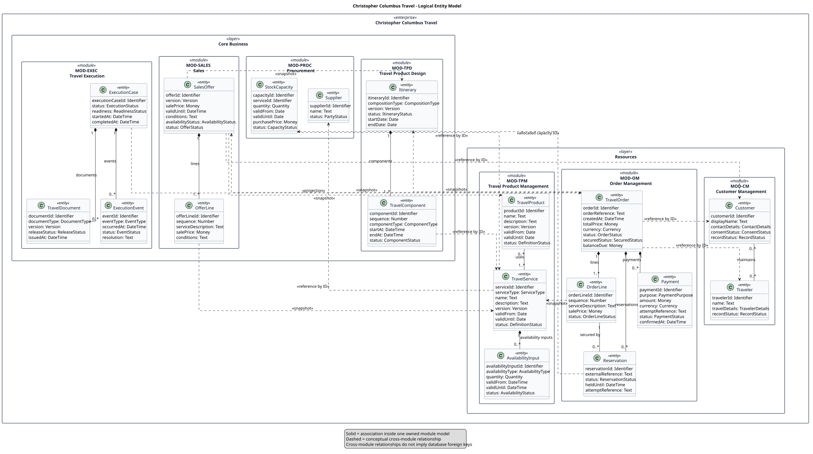

# Logical Data Model

- Status: proposed
- Owner: Architecture
- Last reviewed: 2026-08-03

This technology-neutral logical model refines the accepted [business objects](../../requirements/business-objects.md) into entity candidates owned by modules in the Core Business and Resources layers of the accepted [modular software architecture](../software-architecture/software-architecture.md). It describes business identity, attributes, associations, and ownership. It does not prescribe tables, foreign keys, graph edges, document collections, persistence annotations, or database products.

The accepted business objects and bounded-context ownership are authoritative. Additional entities, attributes, multiplicities, and integration semantics in this document are architecture proposals derived from the currently proposed detailed use cases; accepting this model would not accept those use cases.

## Overview

Solid associations stay within one module-owned model. Dashed cross-module relationships make enterprise-wide business relationships visible while preserving encapsulation:

- `«reference by ID»` means the source retains the target's stable identifier;
- `«snapshot»` means the source retains an immutable representation needed for its own historical consistency;
- `«projection»` means the source consumes a purpose-specific view owned elsewhere.

These relationships do not imply direct object navigation, shared mutable state, a distributed transaction, or a database foreign key. Every entity has exactly one owning module.

## Entity catalog

Attributes use logical domain types. `Identifier`, `Text`, `Date`, `DateTime`, `Money`, `Quantity`, and the named `...Status`/`...Type` types are conceptual value types, not programming-language or storage types.

| Layer / owning module | Entity | Candidate attributes | Evidence and rationale |
|---|---|---|---|
| Core Business / MOD-TPD Travel Product Design | `Itinerary` | `itineraryId`, `compositionType`, `version`, `status`, `startDate`, `endDate` | Accepted business object; Individual/Package Travel, versioned composition, dates, and plausibility evidence from UC-003–005 |
| Core Business / MOD-TPD | `TravelComponent` | `componentId`, `sequence`, `componentType`, `startAt`, `endAt`, `status` | Glossary-defined service selected in a specific travel; ordered composition and timing from UC-003–005 |
| Core Business / MOD-PROC Procurement | `Supplier` | `supplierId`, `name`, `status` | Accepted business object and glossary |
| Core Business / MOD-PROC | `StockCapacity` | `capacityId`, `serviceId`, `quantity`, `validFrom`, `validUntil`, `purchasePrice`, `status` | Stock Service definition and UC-006 information needs |
| Core Business / MOD-SALES Sales | `SalesOffer` | `offerId`, `version`, `salePrice`, `validUntil`, `conditions`, `availabilityStatus`, `status` | Accepted business object and UC-008–010 |
| Core Business / MOD-SALES | `OfferLine` | `offerLineId`, `sequence`, `serviceDescription`, `salePrice`, `conditions` | Candidate immutable commercial breakdown of the offered composition, supported by UC-008–010 |
| Core Business / MOD-EXEC Travel Execution | `ExecutionCase` | `executionCaseId`, `status`, `readiness`, `startedAt`, `completedAt` | Execution state explicitly owned by the bounded context; UC-011–013 |
| Core Business / MOD-EXEC | `TravelDocument` | `documentId`, `documentType`, `version`, `releaseStatus`, `issuedAt` | Glossary and UC-012 |
| Core Business / MOD-EXEC | `ExecutionEvent` | `eventId`, `eventType`, `occurredAt`, `status`, `resolution` | Active-travel event coordination from UC-013 |
| Resources / MOD-CM Customer Management | `Customer` | `customerId`, `displayName`, `contactDetails`, `consentStatus`, `recordStatus` | Accepted business object and UC-014 information needs |
| Resources / MOD-CM | `Traveler` | `travelerId`, `name`, `travelDetails`, `recordStatus` | Glossary distinguishes traveler from customer; UC-003, UC-011–013, UC-016 |
| Resources / MOD-TPM Travel Product Management | `TravelProduct` | `productId`, `name`, `description`, `version`, `validFrom`, `validUntil`, `status` | Accepted business object and UC-015 |
| Resources / MOD-TPM | `TravelService` | `serviceId`, `serviceType`, `name`, `description`, `version`, `validFrom`, `validUntil`, `status` | Accepted business object and UC-015 |
| Resources / MOD-TPM | `AvailabilityInput` | `availabilityInputId`, `availabilityType`, `quantity`, `validFrom`, `validUntil`, `status` | Availability inputs owned by the context; UC-006, UC-009, UC-015 |
| Resources / MOD-OM Order Management | `TravelOrder` | `orderId`, `orderReference`, `createdAt`, `totalPrice`, `currency`, `status`, `securedStatus`, `balanceDue` | Accepted business object and UC-016–018 |
| Resources / MOD-OM | `OrderLine` | `orderLineId`, `sequence`, `serviceDescription`, `salePrice`, `status` | Candidate immutable ordered-service breakdown needed by UC-016–017 |
| Resources / MOD-OM | `Reservation` | `reservationId`, `externalReference`, `status`, `heldUntil`, `attemptReference` | Glossary and UC-017 |
| Resources / MOD-OM | `Payment` | `paymentId`, `purpose`, `amount`, `currency`, `attemptReference`, `status`, `confirmedAt` | Deposit/Payment concepts and UC-018 |

`Traveler`, execution entities, and the supporting line/capacity/arrangement entities refine concepts already present in the glossary, bounded-context ownership, or accepted use-case catalog. Their exact attribute sets remain proposed because the detailed use cases explicitly state that their policies and gaps require stakeholder confirmation.

## Associations and ownership

| Source | Target | Multiplicity / semantics | Meaning |
|---|---|---|---|
| `Itinerary` | `TravelComponent` | `1` composition to `1..*` | An itinerary owns its ordered components. |
| `TravelProduct` | `TravelService` | `0..*` to `1..*` | A maintained product uses one or more reusable services; a service may support multiple products. |
| `TravelService` | `AvailabilityInput` | `1` composition to `0..*` | Availability inputs exist for one maintained service. |
| `SalesOffer` | `OfferLine` | `1` composition to `1..*` | An offer owns its immutable commercial lines. |
| `TravelOrder` | `OrderLine` | `1` composition to `1..*` | An order owns the services captured at ordering time. |
| `TravelOrder` | `Reservation` | `1` composition to `0..*` | Reservations record commitments or holds for an order. |
| `TravelOrder` | `Payment` | `1` composition to `0..*` | Payments are applied exactly once to an order. |
| `ExecutionCase` | `TravelDocument` / `ExecutionEvent` | `1` composition to `0..*` | Execution owns its issued-document and coordination history. |
| `Customer` | `Traveler` | `0..*` association to `0..*` | A customer may maintain travelers; a traveler may be relevant to more than one customer. This multiplicity needs stakeholder confirmation. |
| `TravelComponent` | `TravelService` | `1` `«reference by ID»` | A component identifies the reusable service it instantiates without sharing its model. |
| `TravelService` | `Supplier` | `1` `«reference by ID»` | A service identifies its direct provider; supplier data remains owned by Procurement. |
| `StockCapacity` | `TravelService` | `1` `«reference by ID»` | Purchased capacity applies to one maintained service. |
| `SalesOffer` | `Customer` | `1` `«reference by ID»` | The offer identifies its recipient. |
| `SalesOffer` | `Itinerary` | `1` `«snapshot»` | The offered composition is preserved at its offered version. |
| `SalesOffer` | `TravelProduct` | `0..*` `«snapshot»` | An offer preserves any maintained products included in the commercial composition. |
| `OfferLine` | `TravelService` | `1` `«snapshot»` | Commercial service details remain stable after source definitions change. |
| `TravelOrder` | `Customer` | `1` `«reference by ID»` | The order identifies the ordering customer. |
| `TravelOrder` | `Traveler` | `1..*` `«reference by ID»` | The order identifies its travelers without owning customer records. |
| `TravelOrder` | `SalesOffer` / `Itinerary` | `1` each `«snapshot»` | The accepted offer and composition are preserved as the basis of the order. |
| `OrderLine` | `TravelService` | `1` `«snapshot»` | Ordered service details survive later product-definition changes. |
| `Reservation` | `StockCapacity` | `1` `«reference by ID»` | A reservation records the pre-procured capacity allocated to its ordered service. |
| `Reservation` | `OrderLine` | each reservation secures `1` line; a line has `0..*` attempts/results | The reservation records which ordered service it attempts to secure. |
| `ExecutionCase` | `TravelOrder` | `1` `«projection»` | Execution consumes the order information required to coordinate travel. |

The diagram shows conceptual relationships in both directions where that improves understanding, but its arrows denote knowledge held by the source module, not ownership of the target entity.

## Modeling rules

1. An entity is defined and changed only by its owning module.
2. Within-module composition means lifecycle ownership in this logical model, not a storage decision.
3. Cross-module relationships must declare `reference by ID`, `snapshot`, or `projection` semantics before implementation design.
4. Historical commercial and ordered facts use snapshots so later changes to products, services, itineraries, or offers cannot silently rewrite commitments.
5. Sensitive attributes are deliberately coarse. Identity, contact, consent, traveler, payment, and document detail requires privacy classification and purpose/retention decisions before refinement.

## Limitations and open questions

- Proposed detailed use cases provide candidate attributes but do not yet establish complete invariants, state machines, or optionality.
- `Money`, contact information, personal identity, consent, provenance, audit history, and external credentials require dedicated value-object and security/privacy refinement.
- The model does not yet decide whether Customer and Traveler are persons, organizations, roles, or a party hierarchy.
- Customer-time on-demand sourcing is absent from the model because [SE-002](../../requirements/scope-exclusions.md) limits sales to pre-procured capacity.
- Availability is represented as input evidence, not a promise that availability can be stored as a single current fact.
- Reporting, Accounting, and Human Resources entities are intentionally absent because their implementations are excluded by [SE-001](../../requirements/scope-exclusions.md).
- No association in this model selects relational, graph, document, or hybrid persistence.
