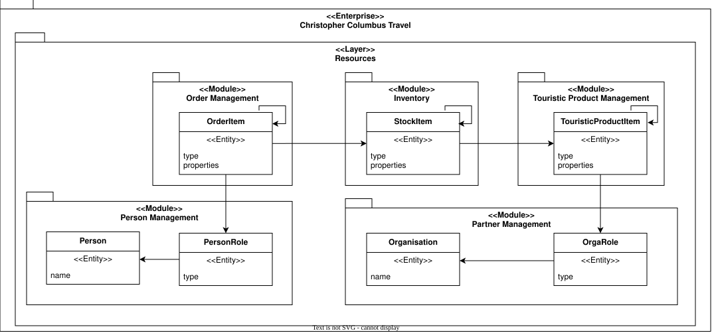
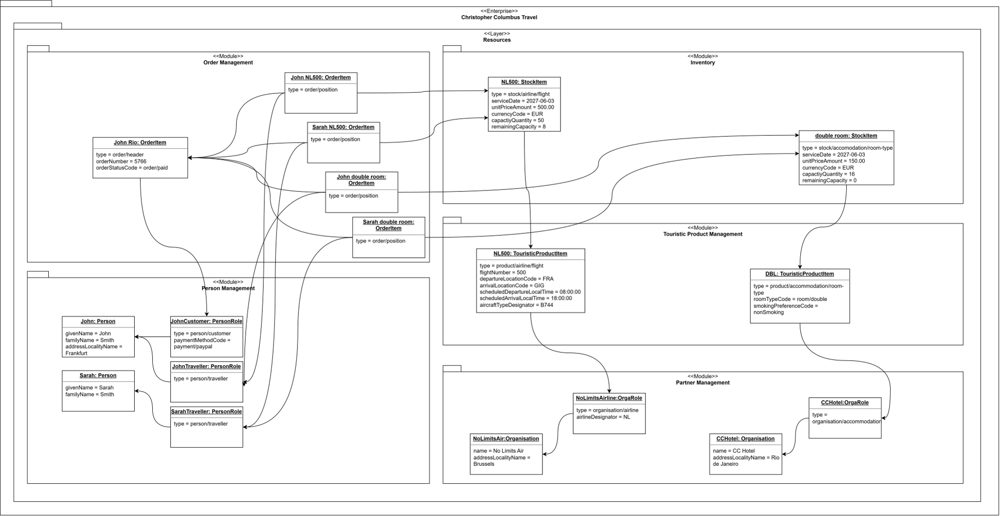

# Logical Entity Model

- Status: proposed
- Owner: Architecture
- Last reviewed: 2026-08-21

This technology-neutral logical entity model defines generic entity structures owned by Resources modules in the accepted [software architecture](../software-architecture/software-architecture.md). It was produced by iteratively refining the accepted [business objects](../../requirements/business-objects.md): recurring party roles and item structures were generalized while concrete business meaning remains expressed through types, properties, and relationships.

It does not prescribe database tables, foreign keys, graph labels, collections, persistence annotations, or a database product.

## Overview

Arrows show conceptual references across entity and module boundaries; they do not by themselves require object navigation or database foreign keys.

## Concrete object usage

The following synthetic object diagram illustrates how the generic logical entity model is used for one comprehensive travel example. It is explanatory architecture evidence, not a physical database design or additional requirements source.

John and Sarah are Persons playing `person/customer` and `person/traveller` roles. Partner Organisations play `organisation/airline` and `organisation/accommodation` roles. Stable partner data, such as the accommodation's address, belongs to the Organisation, while contextual supplier data belongs to its role. Recursive TouristicProductItems use `product/...` types to describe a flight with seats (`product/airline/flight` and its nested `product/airline/flight/seat`) and an accommodation room type with a room (`product/accommodation/room-type` and its nested `product/accommodation/room-type/room`); corresponding `stock/...` StockItems make dated capacity sellable and carry stock-specific commercial data such as the sale price. An `order/header` and its `order/position` OrderItems connect the customer and travelers to the allocated stock.

## Semantic property contracts

Keys and coded values in generic `properties` collections shall use established touristic vocabularies and standards where suitable, for example OpenTravel Alliance (OTA), International Air Transport Association (IATA), and International Civil Aviation Organization (ICAO) specifications. Each adopted vocabulary, version, and any project-specific extension shall be identified explicitly; similar local terms shall not silently replace an applicable standard term or code.

The authoritative [Flexible Entity-model Terminology](terminology.md) defines the current keys, type identifiers, datatypes, value sets, mappings, versions, extensions, and validation examples. New keys or coded values shall be added there before they appear in scenarios, diagrams, contracts, or seed data.

The module that owns an entity shall also own an executable property validator or equivalent declarative rule set. Its rules shall define, at minimum:

- the entity types to which each property applies;
- whether a property is mandatory, optional, conditionally required, or prohibited;
- its datatype, cardinality, format, unit, and permitted vocabulary or value set;
- cross-property and temporal constraints, such as `start < end`; and
- the applicable rule and vocabulary versions.

Owning modules shall validate properties at their boundaries before accepting state changes. Interaction and Core Business Process modules shall consume the owning module's validation result rather than duplicate its semantic rules. Validation failures shall identify the violated rule sufficiently for the calling module to present or handle the error without exposing the Resource module's internal model.

The accepted [flexible entity implementation](implementation.md) realizes these
logical rules through strict module-owned Pydantic contracts and a direct,
loss-aware Neo4j property mapping.

## Entities and module ownership

| Resource module | Entity | Meaning |
|---|---|---|
| Person Management | `Person` | A natural person identified by person-specific properties such as name. |
| Person Management | `PersonRole` | A contextual role played by a Person, such as customer or traveler, with role-specific properties. |
| Partner Management | `Organisation` | An organization identified by organization-specific properties such as name. |
| Partner Management | `OrgaRole` | A contextual role played by an Organisation, such as partner, supplier, airline, or hotel, with role-specific properties. |
| Touristic Product Management | `TouristicProductItem` | A typed reusable touristic product element. Recursive relationships allow composite structures such as a flight type with seats or a room category with rooms. |
| Inventory | `StockItem` | A dated, priced, or otherwise qualified unit of pre-procured sellable stock. Recursive relationships allow stock groupings. |
| Order Management | `OrderItem` | A typed order or ordered component. Recursive relationships allow an order to contain its components. |

## Associations

- A `PersonRole` belongs to a `Person`.
- An `OrgaRole` belongs to an `Organisation`.
- A `TouristicProductItem` may contain or specialize other `TouristicProductItem` instances and refers to the supplying `OrgaRole` where relevant.
- A `StockItem` represents inventory for a `TouristicProductItem` and may participate in a recursive stock structure.
- An `OrderItem` may contain other `OrderItem` instances, refers to the allocated `StockItem`, and links relevant customer/traveler `PersonRole` instances.

Every entity has exactly one owning module. Cross-module associations remain visible because they explain the business graph, but implementation must preserve module encapsulation through identifiers, representations, or module interfaces.

## Computed presentation identity

Issue #50 proposes a read-only presentation projection for the party, role, and product entities covered by [FR-010–FR-014](../../requirements/functional-requirements.md#display-name-and-chain-rules-fr-010fr-014). `displayName` is computed from validated source properties and type/context rules. `displayNameChain` is the ordered root-to-entity sequence of those labels across canonical ownership and product-supplier/composition links. Neither is a flexible property or persisted state, and neither replaces the stable entity identifier.

The owning Resource modules compute their own entity labels. A shared read-model composition service may call those public module services to assemble cross-module product context, consistent with DR-0013's module-boundary rule; Interaction modules shall not reproduce the rules. API responses expose `displayName` and the semantic chain as an ordered array, while the UI chooses the documented ` · ` rendering. Collection and detail projections use the same computation so they cannot drift.

Canonical ownership is singular and product composition is acyclic. Missing data required by a type-specific label, multiple owners or parents, cycles, and conflicting supplier contexts are integrity failures, not occasions to invent an identifier-based label. Supplier context is optional for product types whose own display rule is complete without it; a flight requires an airline supplier because its display name includes that role's `airlineDesignator`.

## Modeling consequences

The generic model deliberately avoids a separate physical entity class for every product subtype or business role. `type` selects the semantic kind and `properties` holds kind-specific information at this logical level. The [semantic property contracts](#semantic-property-contracts) require established touristic vocabularies and owning-module validation. Before implementation, accepted rules must define supported types, property schemas, vocabulary versions, identifiers, multiplicities, and lifecycle constraints. A technology decision must evaluate how those varying structures can be represented without sacrificing validation or queryability.

## Limitations and open questions

- Exact association multiplicities and delete/lifecycle semantics remain to be specified.
- The proposed terminology catalog now defines the types and properties used by the current object example; broader scenario catalogs and accepted vocabulary mappings remain open. Properties must not become uncontrolled free-form data in implementation.
- Prices, dates, addresses, payment methods, identifiers, and personal data require explicit value types, classification, and validation.
- Historical snapshots versus live references must be decided per cross-module relationship.
- Customer-time on-demand sourcing remains excluded by [SE-002](../../requirements/scope-exclusions.md); `StockItem` represents capacity procured before sale.
