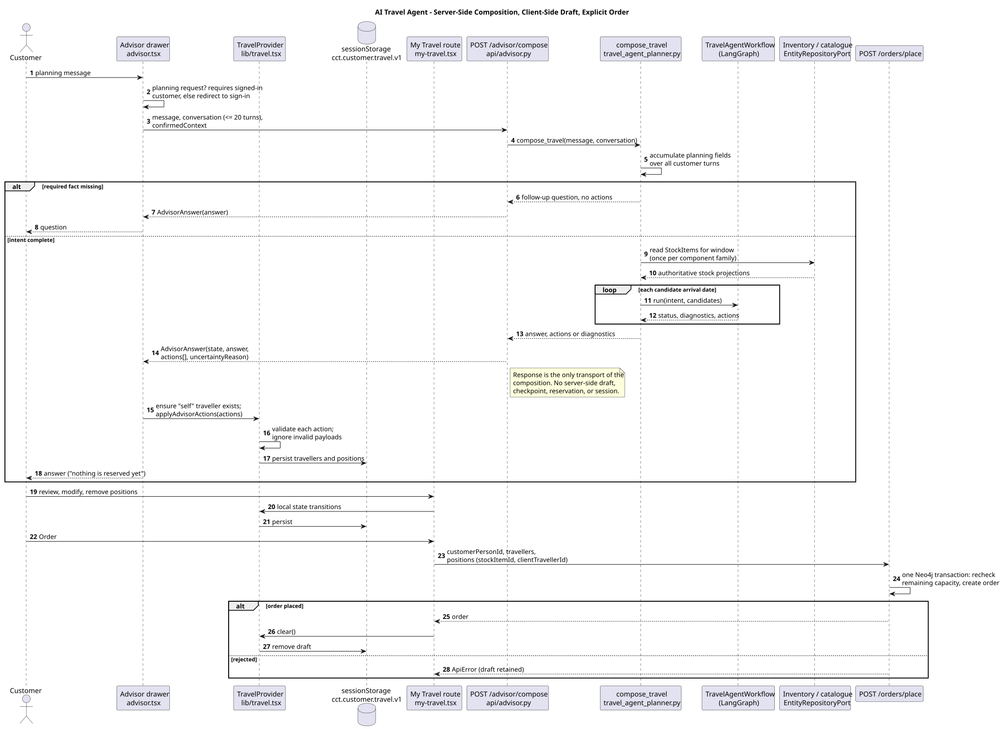

# Backend Architecture

- Status: accepted
- Owner: Architecture/Implementation
- Last reviewed: 2026-09-16

This document is the authoritative backend architecture for `backend/src/cct`.
It specifies the conventions already realized and the conventions every future
backend extension shall follow. It is the implementation companion to the
technology-neutral [modular software architecture](software-architecture.md),
the package mapping in [project-structure.md](project-structure.md), and the
accepted technology profile in
[DR-0010](../../governance/decisions/0010-adopt-python-centered-modular-technology-stack.md).

The rules below extend issues #7–#9, #12, #18–#21, #28–#33, #50, #56, and
#57, and DR-0010, DR-0012, DR-0013, DR-0014, DR-0017, DR-0019, DR-0020, and
DR-0021. The documents and issues contain rationale and evidence; this
document states the conventions future code must follow. It does not replace
requirements, the terminology catalog, API contract, deployment architecture,
or decision records, and does not silently close an open decision.

## 1. Architectural principles

1. The initial runtime is a FastAPI modular monolith, but module ownership and
   interfaces preserve later service extraction, including a separately
   scalable or isolated AI component.
2. A physical Neo4j graph shared by modules does not create shared ownership.
   Each module owns its entities, writes, invariants, terminology contracts,
   and public application operations.
3. FastAPI and Neo4j are adapters. Business modules do not depend on request
   objects, routing, driver sessions, Cypher, or infrastructure details.
4. Flexible data is not untyped data: every entity is validated by one trusted,
   module-owned, versioned contract before persistence.
5. Cross-module behavior uses explicit public operations or bounded projections,
   never generic CRUD, raw graph access, or direct internal repositories.
6. Transaction, authorization, audit, and integrity rules remain between any
   caller—including a future agent—and business state.

## 2. Technology and runtime boundary

DR-0010 selects Python for modules, FastAPI as the HTTP adapter, Pydantic for
boundary/domain contracts, Neo4j Community Edition for the proof of concept,
and Docker localhost as the initial deployment boundary. The selected profile
exists because Python supports shared business/agent logic and Neo4j naturally
represents recursive, heterogeneous, multi-hop graph data. It remains subject
to its recorded validation and revisit triggers; this document does not claim
production readiness.

The initial deployment maps Customer and Staff frontends, the Python API
modular monolith, and Neo4j to documented Docker units. Deployment health,
ports, volumes, startup ordering, recovery, and production hosting belong to
the deployment architecture. Do not infer a production server, HA, horizontal
scaling, disaster recovery, or one-container-per-module design from this
document.

## 2.2 AI Travel Advisor: implemented backend

The accepted local advisor stack is governed by
[DR-0024](../../governance/decisions/0024-local-grounded-advisor-stack.md).
`MOD-ADVISOR` is currently implemented as Python application logic in
`core_processes/customer_care/advisor.py`, exposed by the `/advisor/answer` and
`/advisor/answer/stream` FastAPI routes. It is read-only: it has no order,
inventory, payment, or other mutation tools.

At API startup, `scripts/serve.py` computes a persisted manifest in the
`advisor-state` volume. The manifest contains SHA-256 fingerprints for seed
JSON inputs, seed logic, indexed inputs (product JSON plus glossary), index
logic, the embedding model, and the index schema version. On the first start,
when the Neo4j graph is empty, or when `CCT_FORCE_SEED` is enabled, the
disposable graph is reset and reseeded. A seed fingerprint change also causes
an index rebuild. An index-only fingerprint change rebuilds Qdrant without
re-seeding. If the fingerprints are unchanged, the existing local on-disk
Qdrant collection in the `advisor-index` volume is reused. The explicit
`seed`/`seed-reset` Compose jobs always reseed and rebuild the index, then write
the current manifest.

When an index rebuild is required, the API reads up to 100 product records from
the Touristic Product Management repository and the approved glossary, and
builds the advisor documents. Product documents contain the product ID, type, all
non-null product attributes (including descriptions), and hierarchy-aware
search text. The search text includes the product's ancestors, supplier roles,
supplier organisations, scalar values, and known IATA expansions such as
`FRA`, `Frankfurt`, `Frankfurt am Main`, and `Germany`. Glossary terms are
separate documents. Stock, capacity, price, availability, service dates, and
customer/order context are not indexed.

Retrieval first performs a bounded lexical pass over the local Qdrant payloads.
It recognises product/stock identifiers and directional location expressions
such as `from BER` and `to FRA`; an exact match is returned alone. If no exact
match is found, the complete question is embedded with
`all-MiniLM-L6-v2`, Qdrant returns at most eight candidates with a cosine
threshold of `0.35`, and those candidates become model evidence. There is no
separate live catalogue lookup in the advisor path, so this is not an
authoritative availability or price query. The customer catalogue search has
its own Neo4j live projection and must be used for those facts.

The backend sends the retrieved evidence, confirmed context, and frontend
conversation turns to local `qwen3:8b` through Ollama. The model is instructed
to answer only from the supplied evidence/context; the streaming adapter
forwards Ollama content as NDJSON `chunk` events and then emits a `complete`
state/evidence event. The backend does not persist conversation turns.

### Advisor freshness and known limitations

The manifest is deliberately local and is not a distributed coordination
mechanism. A new or changed product created through the Staff portal does not
update the index after its transaction because staff edits are not included in
the source fingerprint; the explicit rebuild script or a source/logic change
is still required. A changed seed source resets the disposable local graph and
therefore discards staff-created local records. Product projection loading is
currently capped at 100 records, policy documents are not yet part of the
rebuild input, and the exact lexical parser only handles the supported
directional wording rather than arbitrary natural-language constraints. A
manifest can also become stale if only one persistence volume is removed
manually; deleting both `neo4j-data` and `advisor-state` (and, if necessary,
`advisor-index`) makes the next startup reconstruct the state. The index is
therefore a development-time grounded content index, not a continuously
synchronised search service.

### Client-draft travel-composition workflow (#47)

The composition agent is an application capability in
`core_processes/customer_care/travel_agent_workflow.py`, governed by
[DR-0026](../../governance/decisions/0026-use-langgraph-for-client-draft-travel-composition.md).
It uses a compiled LangGraph `StateGraph` with explicit nodes and conditional
edges:



The Mermaid source [travel-agent-graph.mmd](travel-agent-graph.mmd) is
generated by LangGraph from the compiled graph (`graph.get_graph().draw_mermaid()`)
through `python backend/scripts/export_travel_agent_graph.py`; do not edit it by
hand. Solid edges are unconditional, dotted edges are the conditional routes.
`test_travel_agent_graph_diagram.py` fails when the committed source no longer
matches the compiled topology; after regenerating, render the SVG with
`npm run diagrams:render -- docs/architecture/software-architecture/travel-agent-graph.mmd`.

1. `check_intent` verifies that the typed intent contains the minimum data
   needed to plan. Missing destination or arrival/departure dates routes to
   `awaiting-input` and a focused question.
2. `select_candidates` invokes an injected selector. The selector receives
   only bounded, authoritative candidate projections supplied by existing
   catalogue/Inventory operations; it cannot access repositories, Neo4j, raw
   Cypher, or external providers.
3. `validate_composition` combines the browser's current composition with the
   selected candidates and invokes the deterministic domain validator. It
   checks duration, endpoint transport, accommodation coverage, capacity, and
   budget. Invalid compositions terminate with stable diagnostics.
4. `emit_client_actions` converts only a valid selection into typed
   `AdvisorAction` values. Actions identify StockItems/products and are
   proposals for local browser state, not order or reservation commands.

The graph is stateless for this feature: it does not use a checkpointer and
does not create or persist a server-side draft. `POST /advisor/plan` accepts
the current client composition, candidate projections, and selected candidate
IDs, then returns status, diagnostics, and actions. The frontend applies those
actions through `TravelProvider`, which remains the owner of the editable My
Travel session state. The agent never calls `/orders/place`; the existing
customer Order control remains the sole final-submit path.

The customer free-text adapter is `POST /advisor/compose`. It accepts the same
bounded message, conversation, and `confirmedContext` envelope as the ordinary
advisor, extracts supported planning fields, queries only the existing
catalogue/Inventory repository operation, and invokes the graph. It may ask a
follow-up question before composition.

Planning fields are interpreted from the whole conversation in two separated
steps:

1. **Language interpretation** (`travel_intent_extraction.py`). The local
   model of [DR-0024](../../governance/decisions/0024-local-grounded-advisor-stack.md)
   receives every turn, today's date, and the canonical names of the known
   locations, and must answer in the `ExtractedTravelFields` JSON schema
   (Ollama structured output, temperature 0). Every schema key is required but
   nullable, because Ollama otherwise lets the model skip stated facts. The
   model resolves wording, corrections ("the latest statement wins"),
   relative dates, trip lengths such as "a week", party size such as "my wife
   and I", other languages, and short answers from the advisor question they
   answer. Like Neo4j, the model is a required runtime dependency: there is no
   rule-based fallback, and an unavailable model or an answer violating the
   schema raises `AdvisorUnavailable`, returned as HTTP 503.
2. **Deterministic validation** (`normalise_travel_fields` in
   `travel_agent_planner.py`). Extracted values are untrusted. Destination,
   departure city, and partner names are accepted only when grounded in words
   the customer wrote (a resolved location's aliases count, so "Rio" grounds
   "Rio de Janeiro"). Places resolve to codes only through the shared location
   aliases, excluding aliases such as country names that identify no single
   place. Dates must be valid ISO dates from today to the end of the second
   following year; an open month becomes a search window, rolled forward to
   the next year when already past; traveller count, trip length, and budget
   are bounded. Exact dates supersede a contradicting trip length. Exact dates
   that fall into an open month stated in the same answer contradict the
   extraction contract and are discarded in favour of the month, because a
   searched month is safe while invented dates are not. An invalid value
   becomes a missing fact, which leads to a follow-up question, never to a
   guess.

The adapter asks for one missing fact at a time - destination, partner name,
departure city, travel period, duration. For a party larger than one, a
grounded partner name becomes a typed client-side `add-traveller` action
carrying the user-provided given and family names; no synthetic partner name
is substituted. Structured flight fields, rather than possibly malformed
free-text product names, provide flight labels.

An open travel period is a first-class input: a bare month, written in full or
abbreviated, is a search window and not a fixed arrival date. The adapter
combines that window with the stated duration and tries each arrival date in
the month, preferring trips that also end inside it, so an unavailable date is
answered with another date rather than with a demand for exact dates. The
window is read from the catalogue once per component family and every
candidate arrival date is then evaluated in memory; reading per candidate date
made a month-wide search appear to hang. When no date in the window works, the
attempt with the fewest diagnostics is reported rather than the last one
tried.

Capacity selection is party-level: a selected StockItem must have sufficient
remaining capacity for the whole party, and accommodation selection prefers a
double-room product for a two-person party. The graph still revalidates
endpoint transport, every accommodation night, capacity, and budget before it
emits actions. A capacity or completeness failure is returned as an explicit
uncertain response with diagnostics, not as a partial order proposal.

#### Server-client interplay

The composition is computed server-side but owned client-side. The server
holds no draft between requests: each `/advisor/compose` call re-derives the
planning fields from the conversation the browser sends, reads authoritative
StockItems, runs the graph, and returns the result only inside the
`AdvisorAnswer` response. Its `actions` array is the transport of the proposed
components: each `add-position` carries the StockItem ID, product ID, service
date, display-name chain, unit price, and currency; `add-traveller` carries the
user-provided partner names. The frontend (see
[Frontend Architecture §6.1](frontend-architecture.md#61-client-side-ai-travel-agent-composition-47))
ensures the signed-in customer is the `self` traveller, applies the validated
actions through `TravelProvider`, and persists the draft in `sessionStorage`.
Review and edits are volatile local state transitions. Only the explicit Order
control on My Travel sends the draft - reduced to `customerPersonId`,
travellers, and `(stockItemId, clientTravellerId)` positions - to
`POST /orders/place`, which rechecks remaining capacity and creates the order in
one Neo4j transaction. Client-held prices and display names are therefore
presentation hints, never order inputs.



Source: [travel-agent-client-draft.puml](travel-agent-client-draft.puml).

This graph is the orchestration seam, not the source of business truth.
Natural-language intent extraction and live candidate retrieval must call the
existing authenticated API and populate its typed inputs. Model reasoning may
interpret language (as the `/advisor/compose` extractor does) and rank returned
candidates, but it may not invent
availability, dates, prices, capacity, traveller identity, or reservations.
The ordinary `/advisor/answer/stream` RAG path remains separate and read-only;
planning uses typed advisor contracts when action data is required.

## 2.1 Capability ownership for delivered views

The Staff views do not own backend data. They consume the following resource
capabilities through the shared API; future endpoints must preserve this
ownership:

| Delivered view / issue | Owning backend capability |
|---|---|
| Staff home, #28 | Composition of read summaries; it must not become a second persistence model |
| Customers and travellers, #29 | Person Management owns `Person`/`PersonRole`, role lifecycle and payment-category validation |
| Suppliers and partners, #30 | Partner Management owns `Organisation`/`OrgaRole` and supplier relationships |
| Touristic product catalogue, #31 | Touristic Product Management owns recursive `TouristicProductItem` composition and supplier assignment |
| Inventory, #32 | Inventory owns dated `StockItem` capacity, availability and represented-product validation |
| Travel orders, #33 | Order Management owns headers/positions, customer/traveller links, stock allocation and order status |
| Incoming-reference navigation, #49 | A read-only API projection composes accepted incoming counts across Person/Partner/Product/Inventory/Order owners; it does not create a second persistence model |

The API may compose a read projection across these owners, but no view or
router may write another module's entity or bypass its service validation.

`backend/scripts/serve.py` is the composition root allowed to wire
`cct.api` to `cct.infrastructure`. OpenAPI export must work through
`create_app()` without a live database. Configuration and operator scripts stay
outside the installable `cct` namespace.

## 3. Module ownership and dependency direction

The accepted logical layers are Interaction, Core Business Processes, and
Resources. The Python mapping is maintained in `project-structure.md`; the
important future-code rules are:

- Interaction may call Core Business Processes or Resources.
- Core Business Processes may call Resources.
- Resources must not call Interaction, Core Business Processes, or adapters.
- Calls within a layer must remain acyclic.
- `cct.api` invokes application capabilities and never imports infrastructure.
- Only `cct.infrastructure.neo4j` imports the Neo4j driver.
- A module never imports another module's internal repository or persistence
  implementation.

The five Resources modules remain separate even though they share the
`cct.resource_management` namespace: Person Management, Partner Management,
Touristic Product Management, Inventory, and Order Management. Core Process
packages are Season Planning, Procurement, Touristic Product Design, Sales,
and Customer Care. Supporting Accounting, Reporting, and Human Resources are
external/cross-cutting contracts until use-case evidence justifies operations.

Static architecture tests parse imports, reject upward dependencies and
cycles, confine FastAPI/Neo4j imports, and require package READMEs. A package
addition must preserve those checks and document its ownership.

## 4. Module-internal layering and ports

An implemented resource module uses this direction:

```text
API adapter -> owning service.py -> EntityRepositoryPort
                         -> public service operation of another owner (only when needed)
EntityRepositoryPort <- infrastructure/neo4j adapter
```

`service.py` is the public application-operation boundary. `models.py` owns
the module's terminology-specific strict property contracts. The shared
`EntityRepositoryPort` is a narrow structural protocol implemented by the
Neo4j adapter and test fakes. `ScopedEntityRepository` restricts a composed
module to its allowed `EntityKind` values, so a service cannot write another
module's entities.

Cross-module graph reads are owned by the consuming use case and return a
named, bounded projection. For example, Sales may request availability context
across product, stock, and traveller entities, while the Neo4j adapter performs
the traversal. The consumer receives the declared projection, not a driver
session, generic query API, or foreign module model. The first implemented
PoC may use a direct public service call where DR-0013 permits it; adding a new
port or composition mechanism requires evidence that the current boundary is
insufficient.

## 5. Flexible entity contract

Every entity follows this validation pipeline:

```text
untrusted mapping
  -> FlexibleEntity
  -> EntityTypeRegistry[(entityKind, type)]
  -> module-owned StrictProperties
  -> immutable ValidatedEntity
```

`FlexibleEntity` contains `entityId`, `entityKind`, optional terminology-
governed `type`, `schemaVersion`, and an explicit `properties` map. Reserved
structural names cannot be reintroduced as flexible properties. The registry
is assembled by trusted code, has no untrusted runtime registration or dynamic
class creation, and fails closed for unknown types and keys.

The owning model defines required/optional properties, strict datatypes,
formats, units, cardinality, controlled values, and cross-property rules.
Models are frozen. Updates rebuild and fully revalidate a new entity; they do
not mutate a partially validated object. Missing and null are distinct; absent
optional values are omitted from Neo4j. `schemaVersion` changes only through a
reviewed, repeatable contract migration with revalidation.

The terminology catalog is the authority for canonical British-English keys,
namespaced type identifiers, coded values, external vocabulary mappings,
stable TERM IDs, extensions, versions, and deprecations. Standard terms are
not copied into a second registry. Unknown, wrongly typed, reserved, invalid,
or cross-property-inconsistent values fail explicitly.

## 6. Neo4j representation and relationships

Persist each entity as a node with the singular PascalCase label matching its
`EntityKind`: `Person`, `PersonRole`, `Organisation`, `OrgaRole`,
`TouristicProductItem`, `StockItem`, or `OrderItem`. Persist structural fields
and validated supported properties directly, using parameterized Cypher. Do
not use a JSON property blob, unrestricted nested map, runtime labels, or
caller-supplied relationship types.

Supported temporal values remain temporal. Because Neo4j has no exact decimal
property type, money amounts use canonical base-ten strings and the structural
`decimalPropertyKeys` marker so round-trip validation restores `Decimal`. Maps,
nested lists, heterogeneous lists, null list elements, and unsupported objects
fail unless a reviewed lossless mapping is added.

Relationships are the graph representation of `HAS_ROLE`, `CONTAINS`,
`SUPPLIED_BY`, `REPRESENTS_PRODUCT`, `ALLOCATES_STOCK`, `CUSTOMER`, and
`ASSIGNED_TRAVELLER`. Entity references and recursive composition are never
embedded as property maps. Product component reads are recursive but carry the
defensive `PRODUCT_COMPONENT_MAX_DEPTH` bound; this is not a business nesting
limit.

Community Edition uniqueness constraints protect `entityId`, and selected
direct lookup properties may be indexed. Because property existence/type,
node-key, and relationship-key constraints are unavailable in Community
Edition, application validation, managed transactions, schema-versioned
integrity checks, and integration tests remain mandatory.

The customer catalogue projection uses one repository-side joined read to
match sellable StockItems with their represented products, instead of issuing
one relationship query per matching StockItem. The Neo4j adapter also defines
range indexes for StockItem service dates and the persisted capacity/status
properties used by inventory predicates. These are bounded query-path
optimisations, not a substitute for representative-load evidence or a
dedicated search projection; see [performance evidence](../../test/performance-evidence.md).

## 7. Product, inventory, and terminology evolution

Product and OrgaRole family names use matching family segments. Structural
product children are nested below their parent type where the `CONTAINS`
relationship requires it. Stock types use `stock/` plus the complete suffix of
the represented lowest-level product type (DR-0017 and DR-0020). Do not create
an alias or silently retain a deprecated family name.

The #56 capacity convention is traveller-based: accommodation stock represents
room-type/date capacity and flight stock represents flight/date capacity;
individual seat/room products and nested flights are not the target MVP model.
`capacityQuantity` is original purchased capacity. `remainingCapacity` is the
persisted non-negative source of truth; `available` is derived as
`remainingCapacity > 0`. There must not be competing `heldQuantity`,
`allocatedQuantity`, and traveller-capacity calculations without an accepted
meaning and transaction rule.

## 8. Service operations, aggregates, and transactions

Services return validated entities, page results, bounded relationship lists,
or named projections. They do not return HTTP responses or expose persistence.
The API's aggregate/nested rules are explicit: Persons/roles, Organisations/
roles, recursive Products, StockItems, and Order headers/positions have only
the nested operations justified by their ownership and relationships. Inventory
withdrawal preserves historical references; deleting a referenced entity is a
conflict rather than silent detachment.

Validation occurs before opening a write transaction where possible. A normal
Neo4j write uses a driver-managed transaction and parameterized queries. A
cross-module reference is resolved through the owning module before the write;
a failed reference or relationship must not leave a dangling partial result.

Customer order placement is one explicit cross-resource unit of work exposed
by Order Management. It receives the signed-in Customer Person, unique
client-side travellers, and StockItem/traveller position references. The
Neo4j repository rechecks every requested StockItem and grouped required
capacity before writes, then creates missing traveller Persons/roles, the
order header, positions and relationships and decrements capacity within one
driver-managed transaction. A conflict rolls back the complete unit; no
position is silently omitted. Selecting “Myself” reuses the Person's active
traveller role or creates that role in the same transaction. This deliberate
cross-resource transaction is composed behind the Order service operation;
ordinary module-scoped CRUD remains unchanged.

Concurrent no-oversell behavior still requires real Neo4j concurrency evidence
beyond the in-memory rollback/optimistic-conflict tests. A boolean availability
field alone cannot answer a multi-position capacity query.

## 9. FastAPI HTTP adapter

`cct.api` uses one flat router module per resource family. A router owns HTTP
paths, transport Pydantic models, aliases, status codes, OpenAPI operation IDs,
dependency injection, and domain/transport conversion. It calls the owning
service and contains no business rule, Cypher, or driver access.

Transport models reject extra fields and may be lenient only where JSON must
represent ISO date/time or decimal strings. The strict owning domain contract
is applied again after transport conversion. Successful responses expose
explicit resource/projection models; write requests cannot supply computed
display fields.

List endpoints use deterministic keyset pagination ordered by entity ID, with
`limit` bounded from 1 to 100 (default 20), opaque cursor, and `nextCursor`.
Filters execute before pagination. Nested role/position collections are
owner-bounded lists. Bounded graph reads expose only fixed projections such as
product components and order detail; clients cannot supply labels,
relationships, or arbitrary queries.

The shared error contract is `{type, title, detail}`. Domain errors map to
404 not found, 409 duplicate/dependent/graph conflict, 422 request/domain/
reference validation, and 500 wiring/unexpected infrastructure failure.
Handlers do not leak tracebacks, driver messages, or internal query details.
Every mutating route carries the `Actor` dependency, but the current Actor is
a trusted PoC placeholder and is not authorization.

## 10. Computed read projections

`displayName` and `displayNameChain` are computed from current validated
properties, types, and relationships. They are read-only response fields,
never flexible properties, persisted nodes, or writable request fields.
`displayNameChain` is root-to-entity and the selected entity's own display name
is last. The API owns the semantic computation and returns the projection;
frontend code only formats it.

A projection must identify its owner, required cross-module context, bounded
traversal, invalid-graph behavior, and response shape. It must not become a
hidden second source of truth or generic graph-query service. DR-0019 governs
the current display-name projection contract.

Stock item identifiers are backend-owned immutable references and are not
derived from product identifiers or service dates. Clients resolve dated stock
through the filtered `GET /stock-items` projection (`productId`,
`serviceDateFrom`, and `serviceDateTo`) and use the returned `entityId` for
detail, availability, and allocation operations. `remainingCapacity` in the
projection is authoritative for current availability; a successful lookup
does not by itself authorize an allocation, which is revalidated by the
transactional order operation.

## 11. Identifiers

Entity IDs are immutable references and are never authorization secrets. The
accepted/current repository policy for generated root IDs is the explicit
prefix registry and database-backed counter described in entity-model
implementation. The proposed DR-0021/#57 policy further specifies six-digit
per-family IDs (`PER`, `ROLE`, `ORG`, `OROLE`, `PRD`, `STK`, `ORD`), per-order
`-P##` position IDs, no reuse after deletion, acceptable gaps, overflow
rollback, and no separate order-number concept. Because DR-0021 remains
proposed, extensions must not claim those final details are accepted until the
decision is accepted; they must still not infer IDs from mutable business data
or rely on ID secrecy.

## 12. Deterministic seed and schema evolution

Seed sources are synthetic, reviewable, deterministic catalogs. The seed
loader validates all source data through the public terminology/registry and
then restores entities and relationships in dependency order. Every seed run
first clears the disposable local graph and then loads the complete catalog;
there is no in-place migration, merge with retained records, or preservation
of compatible seeded IDs. The reset-before-load rule is mandatory because
schema and vocabulary changes must never leave deprecated records in the
inspection database. The loader must not duplicate domain validation or
introduce seed-only terms.

The seed process is not a general migration engine: source validation is part
of the fresh load, and an unexpected validation or infrastructure failure may
leave an empty or partial disposable graph that is recovered by running the
complete seed again. A schema or vocabulary change requires explicit
versioning, updated API/UI/tests, and a fresh seed; historical codes must not
be silently reinterpreted. The
`--reset` command-line option is retained only for compatibility and does not
change the always-fresh behavior.

The accepted PoC seed profile from DR-0014 is concrete: it uses synthetic
Person, PersonRole, Organisation, OrgaRole, recursive product, order header /
position, and dated/priced StockItem catalogs; generates applicable 2027
inventory from 2027-01-01 through 2027-12-31; includes deterministic zero and
non-zero availability; and preserves the distinction between reusable product
definitions and dated sellable stock. Seeded products carry no image
properties.

The seed package is not a performance benchmark, does not make a partial
infrastructure failure atomic, and does not prove concurrent allocation. Those
limitations remain explicit and require separate evidence.

## 13. Testing and operational evidence

Backend tests remain outside production packages and mirror source boundaries.
Use unit tests for service rules, strict validation, repository scoping,
pagination, mapping, IDs, and errors; API tests for transport/OpenAPI/error
contracts; architecture tests for imports/acyclicity; and opt-in Neo4j tests
for real mapping, relationships, indexes, transactions, seed data, rollback,
and concurrency.

`npm run backend:check` compiles and runs the normal test suites. It does not
claim to run real Neo4j integration, Docker, backup/restore, performance, or
CI evidence. Local single-request performance evidence is recorded for #55,
but DR-0016 leaves agent tools, concurrent stock reservation,
rollback, Community Edition backup/recovery/observability/least privilege,
representative NFR-001/NFR-002 load, responsive evidence, and CI automation as
residual risks. New code must not mark those risks closed without the required
evidence.

## 14. Rules for future extensions

Before adding a module, entity type, property, relationship, service operation,
API field, projection, seed record, or persistence query:

1. Identify its owner, stable terminology/requirement IDs, use case, and
   affected decision records.
2. Check this document, `project-structure.md`, the terminology catalog, the
   API architecture, and entity-model implementation before inventing a
   pattern.
3. Add validation to the owning model/registry and keep transport validation
   separate from domain validation.
4. Preserve module direction, scoped repositories, bounded projections,
   explicit transactions, central error mapping, and generated API contracts.
5. Add unit, API, architecture, and real database evidence proportionate to
   the claim; never use a fake to prove database concurrency or operations.
6. Update this document when a convention becomes reusable, and create or
   revise a decision record for a consequential technology, data, transaction,
   security, or ownership choice.

## 15. Continuous realignment

This architecture is reconciled in the same change whenever module layering,
entity contracts, terminology, Neo4j mapping, service/transaction behavior,
API shape, projections, identifiers, seed conventions, or test boundaries
change. The implementation and tests provide realization evidence; accepted
requirements and decision records remain authoritative for intent, rationale,
and unresolved risk.

## Decision record index

[DR-0010](../../governance/decisions/0010-adopt-python-centered-modular-technology-stack.md)
selects Python/FastAPI/Pydantic/Neo4j, controlled agent tools, and a modular
monolith with explicit revisit triggers.
[DR-0012](../../governance/decisions/0012-use-validated-property-registry-and-direct-neo4j-properties.md)
defines the immutable validated registry, direct Neo4j properties, decimal
mapping, supported values, constraints, and Community Edition compensations.
[DR-0013](../../governance/decisions/0013-shared-resource-crud-api-and-openapi-contract.md)
defines aggregate boundaries, repository scoping, bounded reads, errors,
pagination, transactions, and OpenAPI/TypeScript generation.
[DR-0014](../../governance/decisions/0014-deterministic-seed-data-and-compose-seeding.md)
defines deterministic synthetic seed catalogs, 2027 inventory,
Compose integration, reset/reseed, and seed limitations.
[DR-0017](../../governance/decisions/0017-align-orgarole-and-touristicproductitem-type-families.md)
defines family-segment and structural-child naming alignment.
[DR-0019](../../governance/decisions/0019-compute-resource-display-projections.md)
defines non-persisted display-name and chain projections.
[DR-0020](../../governance/decisions/0020-align-stockitem-types-with-product-leaves.md)
defines StockItem type suffix alignment with represented product leaves.
[DR-0021](../../governance/decisions/0021-transaction-safe-prefixed-identifiers.md)
is the proposed source for the final generated-ID counter/prefix contract and
must be accepted before its unresolved details become normative.
[DR-0026](../../governance/decisions/0026-use-langgraph-for-client-draft-travel-composition.md)
selects LangGraph for the stateless client-draft composition workflow and
preserves the existing API/final-order boundaries.
