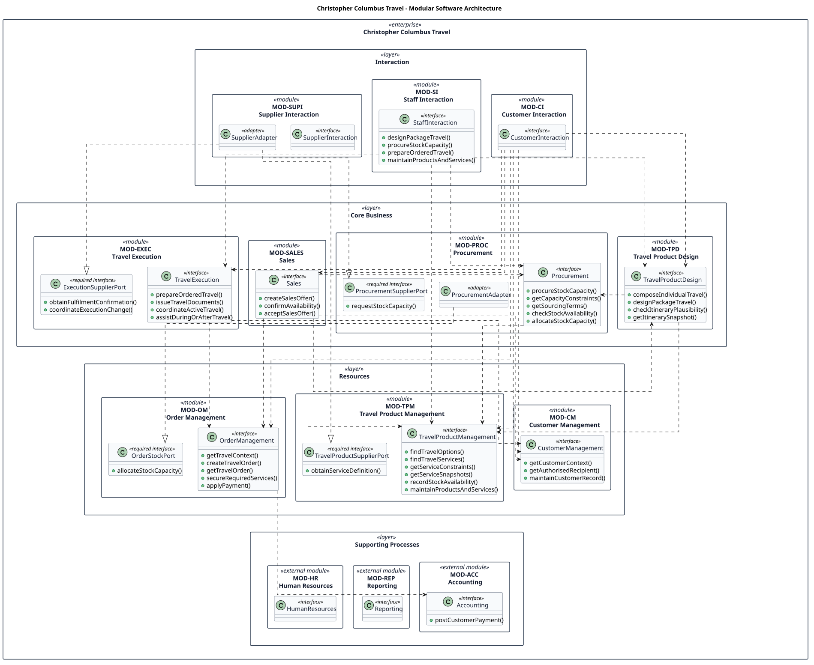

# Modular Software Architecture

- Status: accepted
- Owner: Architecture
- Last reviewed: 2026-08-03

This specification defines technology-neutral software modules, their provided interfaces, and their dependencies. It does not select processes, containers, servers, independently deployable services, or infrastructure. The same module boundaries must remain implementable as a modular monolith, independently deployable services, or a hybrid such as a main backend with a separately scalable AI capability. Runtime placement belongs to [Deployment Architecture](../../operations/deployment-architecture.md).

This architecture is accepted on the expectation that later detail changes to the currently proposed use cases will not substantially alter its module boundaries. Proposed use cases remain provisional requirements inputs: accepting this derived architecture does not accept those use cases. Material use-case changes must trigger architecture impact analysis under the [modular software architecture workflow](../../governance/workflows/modular-software-architecture.md).

## DDD and UML terminology

A DDD bounded context is a boundary within which a domain model and its language are consistent. A software module is an implementation boundary that encapsulates code and exposes interfaces. The accepted [bounded contexts](../../requirements/bounded-contexts/bounded-contexts.md) are therefore starting candidates for modules, not synonyms for them. This initial design maps each implemented bounded context to one UML package stereotyped `«module»`; later evidence may justify splitting or combining modules without silently changing the bounded-context model.

The Accounting, Reporting, and Human Resources bounded contexts remain visible as external module contracts. Their implementations are excluded by [SE-001](../../requirements/scope-exclusions.md).

Customer-time on-demand sourcing is excluded by [SE-002](../../requirements/scope-exclusions.md). UC-007 and its historical diagram source are retained as deprecated evidence but do not contribute operations or capabilities to this accepted architecture.

## Method and evidence

Each accepted use case has a module-level UML sequence diagram. Lifelines are actors, candidate modules, and required ports. A message received through a module's public contract becomes a candidate operation on its provided interface. When a module needs a capability that would otherwise create an upward layer dependency, the consuming module owns a required port and an adapter in the other layer implements it. The runtime invocation through that port does not reverse the static source dependency. The module overview groups modules by the same enterprise layers as the bounded-context model and shows both provided interfaces and required ports.

### UC-001: Seek Travel Advice

[Requirement](../../requirements/use-cases/uc-001-seek-travel-advice.md)

### UC-002: Obtain Ongoing Travel Assistance

[Requirement](../../requirements/use-cases/uc-002-obtain-ongoing-travel-assistance.md)

### UC-003: Compose Individual Travel

[Requirement](../../requirements/use-cases/uc-003-compose-individual-travel.md)

### UC-004: Design Package Travel

[Requirement](../../requirements/use-cases/uc-004-design-package-travel.md)

### UC-005: Obtain a Plausible Itinerary

[Requirement](../../requirements/use-cases/uc-005-obtain-plausible-itinerary.md)

### UC-006: Procure Stock Services

[Requirement](../../requirements/use-cases/uc-006-procure-stock-services.md)

### UC-008: Receive a Sales Offer

[Requirement](../../requirements/use-cases/uc-008-receive-sales-offer.md)

### UC-009: Obtain Availability Confirmation

[Requirement](../../requirements/use-cases/uc-009-obtain-availability-confirmation.md)

### UC-010: Accept a Sales Offer

[Requirement](../../requirements/use-cases/uc-010-accept-sales-offer.md)

### UC-011: Prepare Ordered Travel

[Requirement](../../requirements/use-cases/uc-011-prepare-ordered-travel.md)

### UC-012: Receive Travel Documents

[Requirement](../../requirements/use-cases/uc-012-receive-travel-documents.md)

### UC-013: Coordinate Active Travel

[Requirement](../../requirements/use-cases/uc-013-coordinate-active-travel.md)

### UC-014: Maintain a Customer Record

[Requirement](../../requirements/use-cases/uc-014-maintain-customer-record.md)

### UC-015: Maintain Travel Products and Services

[Requirement](../../requirements/use-cases/uc-015-maintain-travel-products-and-services.md)

### UC-016: Place a Travel Order

[Requirement](../../requirements/use-cases/uc-016-place-travel-order.md)

### UC-017: Secure Required Travel Services

[Requirement](../../requirements/use-cases/uc-017-secure-required-travel-services.md)

### UC-018: Pay for Travel

[Requirement](../../requirements/use-cases/uc-018-pay-for-travel.md)

The diagrams deliberately show module responsibilities rather than repeating every generic authorization, validation, provenance, retry, and communication step from the use-case template. Those behaviors remain requirements of their owning use cases and will later be refined into shared services only when evidence justifies another module.

The module overview displays operations on interfaces whose lists remain compact. Operations for the larger Customer Interaction interface are kept in the catalog below to preserve diagram readability.

## Candidate modules and provided interfaces

Operations are architectural candidates derived from use-case calls. Names may be refined while preserving their responsibility and traceability.

| Module ID | Module / provided interface | Candidate operations | Derived from |
|---|---|---|---|
| MOD-CI | Customer Interaction / `CustomerInteraction` | `seekTravelAdvice`, `obtainOngoingAssistance`, `composeIndividualTravel`, `checkItineraryPlausibility`, `requestSalesOffer`, `confirmAvailability`, `acceptSalesOffer`, `receiveTravelDocuments`, `coordinateActiveTravel`, `maintainCustomerRecord`, `placeTravelOrder`, `secureRequiredServices`, `payForTravel` | UC-001–003, UC-005, UC-008–010, UC-012–014, UC-016–018 |
| MOD-SI | Staff Interaction / `StaffInteraction` | `designPackageTravel`, `procureStockCapacity`, `prepareOrderedTravel`, `maintainProductsAndServices` | UC-004, UC-006, UC-011, UC-015 |
| MOD-SUPI | Supplier Interaction / `SupplierInteraction` | none yet; supplier-facing outbound calls are adapter implementations of business-owned required ports | no accepted supplier-initiated use case |
| MOD-TPD | Travel Product Design / `TravelProductDesign` | `composeIndividualTravel`, `designPackageTravel`, `checkItineraryPlausibility`, `getItinerarySnapshot` | UC-003–005, UC-008 |
| MOD-PROC | Procurement / `Procurement` | `procureStockCapacity`, `getCapacityConstraints`, `getSourcingTerms`, `checkStockAvailability`, `allocateStockCapacity` | UC-004, UC-006, UC-008–009, UC-017 |
| MOD-SALES | Sales / `Sales` | `createSalesOffer`, `confirmAvailability`, `acceptSalesOffer` | UC-008–010 |
| MOD-EXEC | Travel Execution / `TravelExecution` | `prepareOrderedTravel`, `issueTravelDocuments`, `coordinateActiveTravel`, `assistDuringOrAfterTravel` | UC-002, UC-011–013 |
| MOD-CM | Customer Management / `CustomerManagement` | `getCustomerContext`, `getAuthorisedRecipient`, `maintainCustomerRecord` | UC-001, UC-008, UC-012, UC-014 |
| MOD-TPM | Travel Product Management / `TravelProductManagement` | `findTravelOptions`, `findTravelServices`, `getServiceConstraints`, `getServiceSnapshots`, `recordStockAvailability`, `maintainProductsAndServices` | UC-001, UC-003–006, UC-008–009, UC-015 |
| MOD-OM | Order Management / `OrderManagement` | `getTravelContext`, `createTravelOrder`, `getTravelOrder`, `secureRequiredServices`, `applyPayment` | UC-002, UC-010–013, UC-016–018 |
| MOD-ACC | Accounting contract / `Accounting` | `postCustomerPayment` | UC-018 |
| MOD-REP | Reporting contract / `Reporting` | none yet | no accepted use-case call |
| MOD-HR | Human Resources contract / `HumanResources` | none yet | no accepted use-case call |

## Business-owned required ports

Required ports express capabilities needed by a business module without making that module statically depend on an interaction adapter or an upper-layer module. The implementing adapter depends on the port contract owned by the consumer.

| Owning module | Required port | Candidate operations | Implemented by | Evidence |
|---|---|---|---|---|
| MOD-PROC | `ProcurementSupplierPort` | `requestStockCapacity` | `SupplierAdapter` in MOD-SUPI | UC-006 |
| MOD-EXEC | `ExecutionSupplierPort` | `obtainFulfilmentConfirmation`, `coordinateExecutionChange` | `SupplierAdapter` in MOD-SUPI | UC-011, UC-013 |
| MOD-TPM | `TravelProductSupplierPort` | `obtainServiceDefinition` | `SupplierAdapter` in MOD-SUPI | UC-015 |
| MOD-OM | `OrderStockPort` | `allocateStockCapacity` | `ProcurementAdapter` in MOD-PROC | UC-017 |

## Dependency rule and result

A direct module caller depends on the receiving module's provided interface. A call through a required port instead creates a static dependency from the implementing adapter to the port-owning module. Duplicate edges across use cases collapse into one module dependency. Dependencies may remain within a layer or point downward from Interaction through Core Business and Resources to Supporting Processes; they must not point upward. The resulting graph is acyclic and contains no upward layer dependency.

One valid topological order is:

1. Customer Interaction, Staff Interaction, Supplier Interaction;
2. Travel Execution, Sales;
3. Travel Product Design, Customer Management;
4. Procurement;
5. Order Management;
6. Travel Product Management, Accounting;
7. Reporting, Human Resources (currently isolated contracts).

The ordering is validation evidence, not a runtime or deployment order. Any future call that points from a later group to an earlier group creates a cycle and requires refactoring or explicit architecture review.

## Deployment freedom

The module interfaces are local or remote-capable contracts; this specification does not choose which. Consequently, the following remain viable:

- a modular monolith with all implemented modules in one deployable application;
- independently deployable services aligned with some or all modules;
- a hybrid in which most modules share a deployable application while selected capabilities, such as AI-assisted interaction, scale separately.

No module may rely on in-process access to another module's internal model or persistence. Cross-module use is through the interfaces listed here, irrespective of later deployment.

## Limitations and review findings

- The detailed use cases are proposed and intentionally generic. The operation names are therefore candidates, not proof of complete contracts, parameters, errors, or transaction semantics.
- Reporting and Human Resources have no accepted use-case interaction; inventing operations for them would exceed current evidence.
- Supplier Interaction has no accepted supplier-initiated use case. Its current evidence supports outbound adapters implementing business-owned required ports, not operations on its empty provided interface.
- Authentication, authorization, audit, notification, and AI orchestration are cross-cutting concerns but are not yet justified as separate modules. Their placement remains open for later architecture refinement.
- The sequence diagrams show normal coordination paths. Use-case extensions remain authoritative for missing information, failed participants, rejection, retry, and handover behavior.
