# Modular Software Architecture

- Status: accepted
- Owner: Architecture
- Last reviewed: 2026-08-05

This specification defines technology-neutral software modules, their responsibilities, candidate operations, and permitted dependency direction. It does not select processes, containers, servers, databases, protocols, or infrastructure. The module boundaries remain compatible with a modular monolith, independently deployable services, or a hybrid deployment.

## Derivation and refinement

The accepted [business domains](../../requirements/domains/domains.md) are the problem-space starting point. Domains initially suggest modules, but they are not software boundaries by definition. Iterative refinement retained Customer Interaction and Staff Interaction as solution-space entry modules and extracted reusable Resources modules—Person Management, Partner Management, Touristic Product Management, Inventory, and Order Management—from information and lifecycle responsibilities shared across several domains.

The resulting solution-space architecture is authoritative in the diagram below.

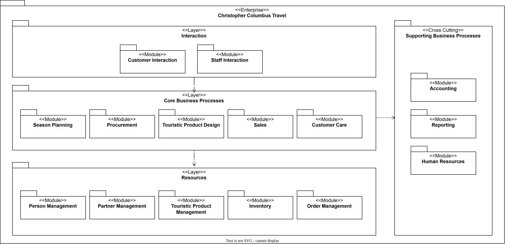

The layers define allowed static dependency direction:

1. Interaction may call Core Business Processes or jump directly to Resources.
2. Core Business Processes may call Resources.
3. Resources must not call Core Business Processes or Interaction.
4. Calls within one layer are permitted when acyclic.
5. Accounting, Reporting, and Human Resources are cross-cutting external contracts under [SE-001](../../requirements/scope-exclusions.md).

Customer-time on-demand sourcing remains excluded by [SE-002](../../requirements/scope-exclusions.md); deprecated UC-007 contains no business-module behavior.

## Modules and candidate provided operations

Operations are derived from received messages in the active use-case sequence diagrams. Parameters and result types remain candidates until detailed contracts are designed.

| Layer | Module ID / module | Candidate operations |
|---|---|---|
| Interaction | MOD-CI / Customer Interaction | `seekTravelAdvice`, `obtainOngoingAssistance`, `composeIndividualTravel`, `checkItineraryPlausibility`, `requestSalesOffer`, `confirmAvailability`, `acceptSalesOffer`, `receiveTravelDocuments`, `coordinateActiveTravel`, `maintainCustomerRecord`, `placeTravelOrder`, `secureRequiredServices`, `payForTravel` |
| Interaction | MOD-SI / Staff Interaction | `designPackageTravel`, `procureStockCapacity`, `prepareOrderedTravel`, `maintainProductsAndServices` |
| Core Business Processes | MOD-SP / Season Planning | `getSeasonPlan`, `coordinateProductMaintenance` |
| Core Business Processes | MOD-PROC / Procurement | `procureStockCapacity` |
| Core Business Processes | MOD-TPD / Touristic Product Design | `composeIndividualTravel`, `designPackageTravel`, `checkItineraryPlausibility`, `getCompositionSnapshot` |
| Core Business Processes | MOD-SALES / Sales | `createSalesOffer`, `confirmAvailability`, `acceptSalesOffer`, `validateAcceptedOffer` |
| Core Business Processes | MOD-CARE / Customer Care | `assistTraveler`, `prepareOrderedTravel`, `issueTravelDocuments`, `coordinateActiveTravel` |
| Resources | MOD-CM / Person Management | `getCustomerContext`, `getTravelerRequirements`, `getCustomerRole`, `getTravelerContext`, `getAuthorisedRecipients`, `updatePersonAndRoles` |
| Resources | MOD-SM / Partner Management | `getSupplierRole`, `getSupplierRoles`, `getFulfilmentContacts`, `getSupplierContacts` |
| Resources | MOD-TPM / Touristic Product Management | `findTouristicProducts`, `findProductItems`, `getProductStructures`, `getProductConstraints`, `getProductItem`, `getProductRepresentations`, `maintainProductItems` |
| Resources | MOD-INV / Inventory | `findAvailableStock`, `getCapacityOutlook`, `verifyStockCompatibility`, `recordStockItems`, `priceAvailableStock`, `confirmStockAvailability`, `getAllocatedStock`, `allocateStockItem` |
| Resources | MOD-OM / Order Management | `getOrderContext`, `recordAcceptedOffer`, `getOrder`, `getDocumentReleaseContext`, `getActiveOrderContext`, `createOrder`, `secureRequiredServices`, `applyPayment` |
| Supporting Business Processes | MOD-ACC / Accounting | `postCustomerPayment` |
| Supporting Business Processes | MOD-REP / Reporting | none yet |
| Supporting Business Processes | MOD-HR / Human Resources | none yet |

## Use-case interaction evidence

Each active use case has one UML sequence diagram whose module lifelines conform to the accepted architecture. UC-007 is shown only as an excluded historical interaction.

### UC-001: Seek Travel Advice

### UC-002: Obtain Ongoing Travel Assistance

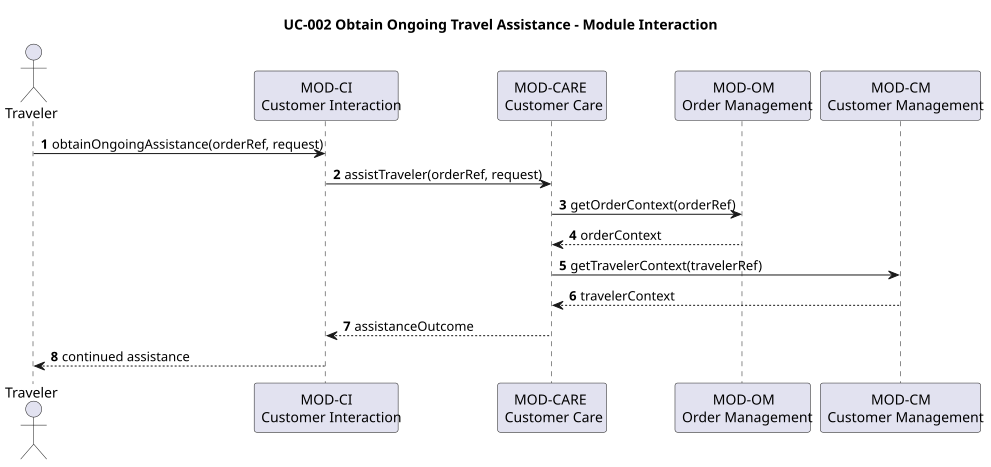

### UC-003: Compose Individual Travel

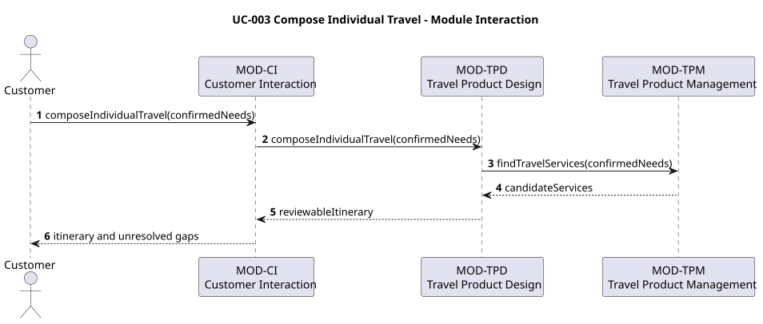

### UC-004: Design Package Travel

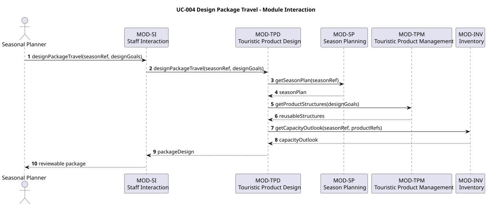

### UC-005: Obtain a Plausible Itinerary

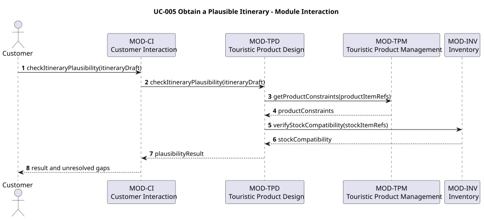

### UC-006: Procure Stock Services

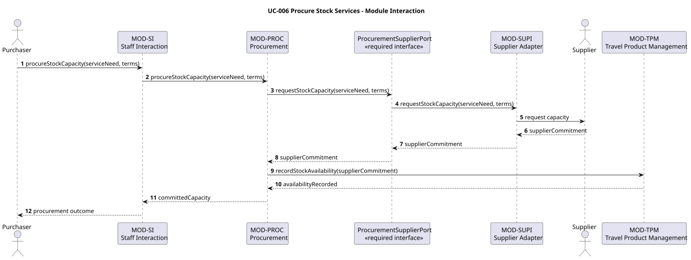

### UC-007: Arrange On-demand Sourcing — deprecated and excluded

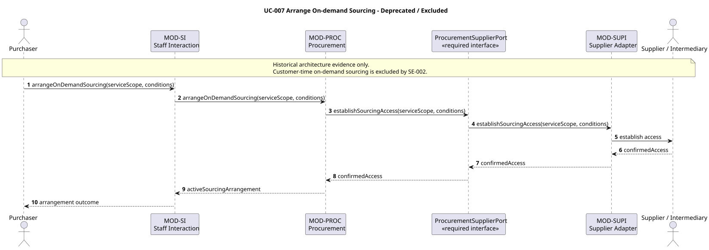

### UC-008: Receive a Sales Offer

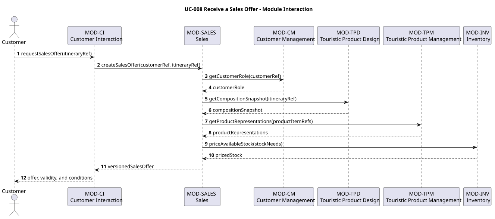

### UC-009: Obtain Availability Confirmation

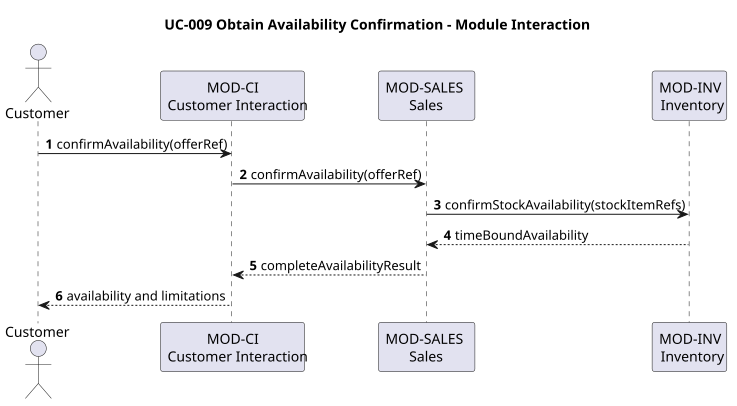

### UC-010: Accept a Sales Offer

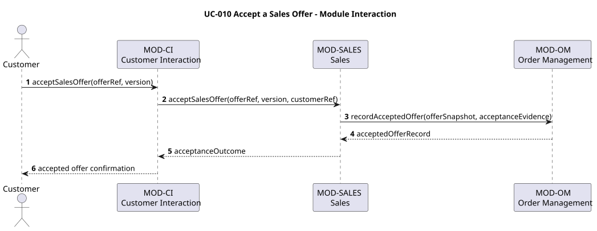

### UC-011: Prepare Ordered Travel

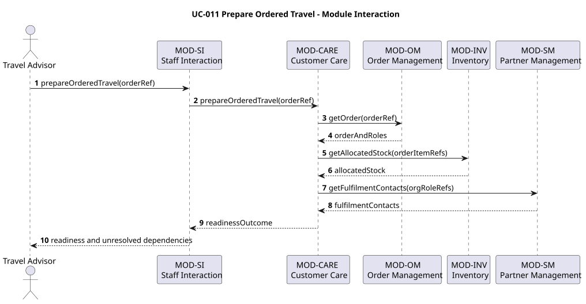

### UC-012: Receive Travel Documents

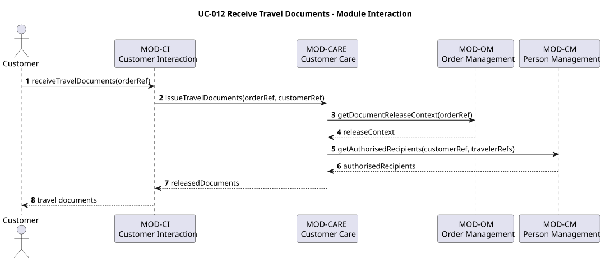

### UC-013: Coordinate Active Travel

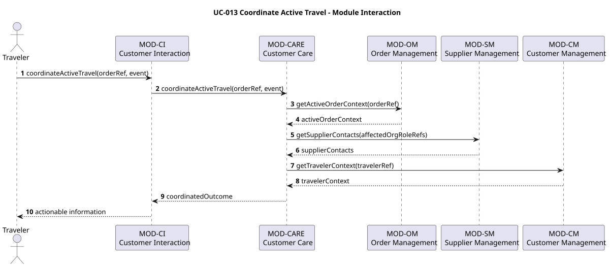

### UC-014: Maintain a Customer Record

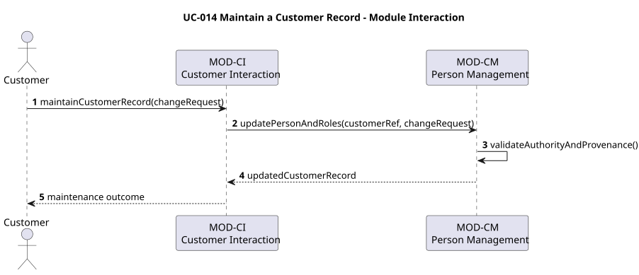

### UC-015: Maintain Travel Products and Services

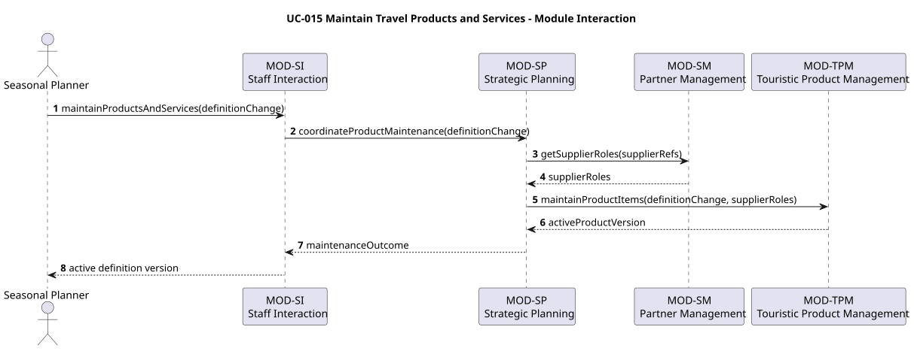

### UC-016: Place a Travel Order

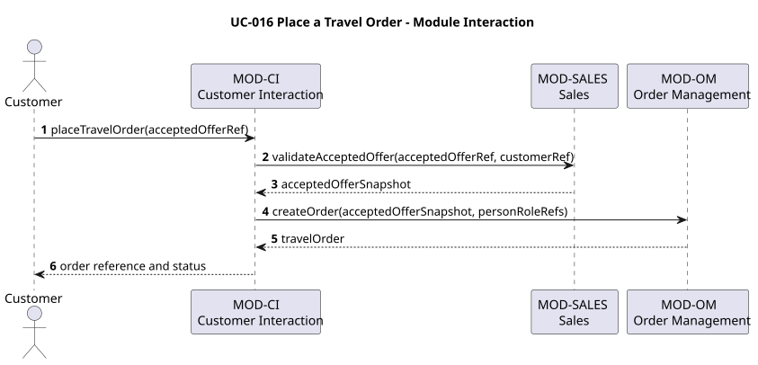

### UC-017: Secure Required Travel Services

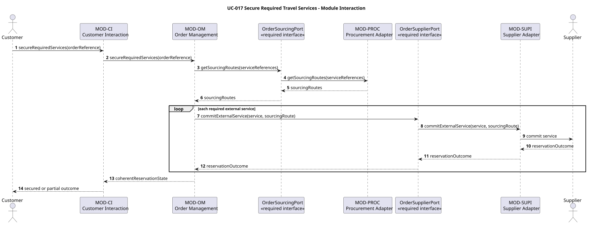

### UC-018: Pay for Travel

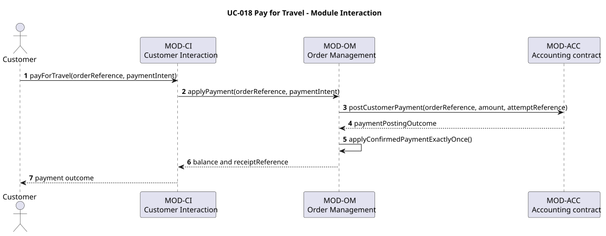

## Dependency validation

Direct module calls are derived from the sequence diagrams. The automated architecture check verifies that all lifelines name modules from the architecture overview, all active use cases are represented, no call points upward through the layers, and the resulting module dependency graph is acyclic. Layer jumps from Interaction directly to Resources are intentionally valid.

## Deployment freedom and encapsulation

Cross-module behavior uses provided operations irrespective of whether the eventual call is local or remote. No module may access another module's internal model or persistence directly. The package arrangement is a logical architecture and does not imply one deployable unit per module.

## Limitations

- Operation names are candidates derived from proposed detailed use cases; complete parameters, errors, events, and transaction semantics remain open.
- Supplier-facing web interaction remains an accepted requirement, but the refined architecture has no dedicated Supplier Interaction module. Its UI placement must be resolved before implementation.
- Reporting and Human Resources have no active use-case messages; operations were not invented without evidence.
- The generic item/role data model requires concrete type catalogs, property schemas, vocabulary versions, validation rules, multiplicities, and snapshot policies before implementation.
