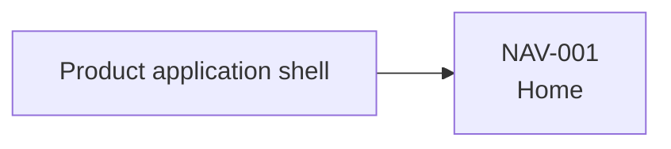

# Navigation Map

- Status: draft
- Owner: Requirements
- Last reviewed: YYYY-MM-DD

## Purpose and model boundary

<!-- State the product or channel boundary, intended coverage, and what the navigation map does not prescribe. -->

## How to read this navigation map

<!-- Explain the hierarchy, edge meanings, grouping, and lifecycle status of provisional destinations. -->

## Navigation principles

| ID | Principle | Evidence or rationale | Status |
|---|---|---|---|
| UX-NAV-001 |  |  | draft |

## Navigation map

## Navigation inventory

| ID | Destination | Navigation label | Actor-facing purpose | Entry points | Related actors and use cases | Status |
|---|---|---|---|---|---|---|
| NAV-001 |  |  |  |  |  | draft |

## Application-shell and orientation expectations

<!-- Record persistent navigation and orientation needs without defining implementation architecture. -->

## Actor-goal coverage

| Actor or context | Goals covered | Entry path or disposition | Validation need |
|---|---|---|---|
|  |  |  |  |

## Assumptions and open questions

| Type | Statement | Affected destinations | Owner | Resolution condition |
|---|---|---|---|---|
| Assumption or open question |  |  |  |  |

## Retired destinations

| ID | Former destination | Retirement reason | Successor or disposition | Status |
|---|---|---|---|---|
|  |  |  |  | deprecated |

## Cross-artifact handoffs

| Owning artifact or workflow | Required change or question | Affected IDs | Owner and resolution condition |
|---|---|---|---|
|  |  |  |  |

## Sources and related artifacts

- [Product Vision](../../requirements/vision.md)
- [Domain glossary](../../requirements/glossary.md)
- [Actors](../../requirements/actors.md)
- [Use-case catalog](../../requirements/use-cases/use-cases.md)
- [Scope exclusions](../../requirements/scope-exclusions.md)
- [Constraints and assumptions](../../requirements/constraints.md)
- [Wireframes](../../requirements/ux/wireframes/wireframes.md)
- [Design System](../../requirements/ux/design-system/design-system.md)
