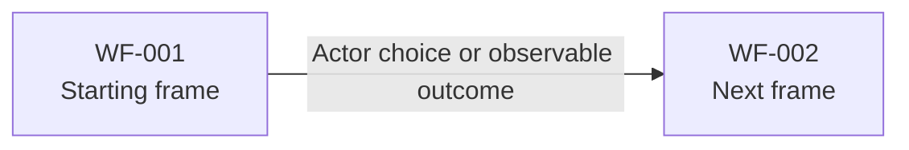

# Wireframes

- Status: draft
- Owner: Requirements
- Last reviewed: YYYY-MM-DD

## Purpose and model boundary

<!-- State the represented actors, interactions, channels, and contexts. Explain what the wireframes do not prescribe. -->

## How to read these wireframes

<!-- Explain the frame notation, identifier conventions, annotations, and relationship to use cases and the navigation map. -->

## Frame inventory

| ID | Frame or state | Actor-facing purpose | Related actors | Related use cases | Navigation-map destination or entry point | Status |
|---|---|---|---|---|---|---|
| WF-001 |  |  |  |  |  | draft |

## Wireframe flow

<!-- Optional: include only when a compact Mermaid view materially improves comprehension and remains readable. It is not the authoritative business sequence. -->



## Interactive HTML rendering

<!-- Optional: link a browser-viewable low-fidelity rendering only when clickability materially improves review. State that this Markdown document remains authoritative for frame meaning, annotations, lifecycle, and unresolved questions. -->

## WF-001: Actor-facing frame name

```text
+------------------------------------------------------------+
| Product identity · Current organization/location · User    |
+----------------+-------------------------------------------+
| Navigation     | Page title                                |
|                |                                           |
|                | Information and actions                   |
|                |                                           |
|                | [Secondary action]        [Primary action]|
+----------------+-------------------------------------------+
| Status and global messages                                 |
+------------------------------------------------------------+
```

Annotations:

- **Purpose and context:**
- **Information and disclosure:**
- **Actions and transitions:**
- **Feedback, validation, and recovery:**
- **Accessibility:**
- **Assumptions or unresolved rules:**
- **Traceability:** Related `ACT-`, `UC-`, `NAV-`, `BO-`, `CON-`, `FR-`, or `NFR-` identifiers.

## Cross-frame states and recovery

| ID | State | Required UX behavior | Related frames and use-case behavior | Status |
|---|---|---|---|---|
| UX-WF-001 |  |  |  | draft |

## Responsive, device, and context assumptions

| Type | Statement | Affected frames | Owner | Resolution condition |
|---|---|---|---|---|
| Assumption or open question |  |  |  |  |

## Validation needs and open questions

| Type | Statement | Affected frames or states | Owner | Resolution condition |
|---|---|---|---|---|
| Assumption or open question |  |  |  |  |

## Retired frames and states

| ID | Former frame or state | Retirement reason | Successor or disposition | Status |
|---|---|---|---|---|
|  |  |  |  | deprecated |

## Cross-artifact handoffs

| Owning artifact or workflow | Required change or question | Affected IDs | Owner and resolution condition |
|---|---|---|---|
|  |  |  |  |

## Sources and related artifacts

- [Product Vision](../../requirements/vision.md)
- [Domain glossary](../../requirements/glossary.md)
- [Actors](../../requirements/actors.md)
- [Use-case catalog](../../requirements/use-cases/use-cases.md)
- [Navigation Maps](../../requirements/ux/navigation-maps/navigation-maps.md)
- [Design System](../../requirements/ux/design-system/design-system.md)
- [Scope exclusions](../../requirements/scope-exclusions.md)
- [Constraints and assumptions](../../requirements/constraints.md)
