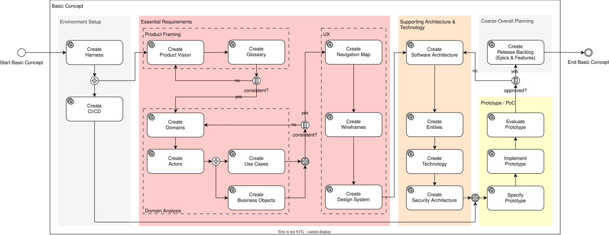
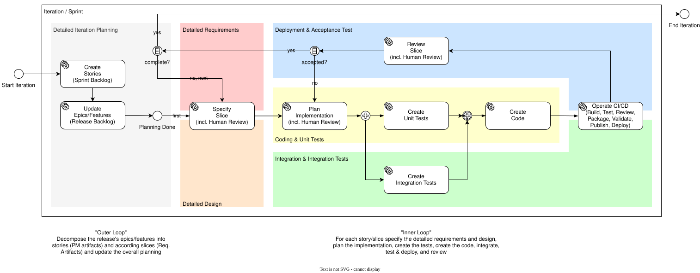

# Agent Workflows

- Status: draft
- Owner: Management
- Last reviewed: 2026-09-20

## Purpose and authority

This document defines how agent tasks establish an initial product and engineering baseline and then evolve it through iterations or sprints. It is the authoritative coordination model for the two graphical main-path views below.

The diagrams deliberately simplify the complete lifecycle. They show important task order, concurrency, review, and feedback but do not replace the owning skill instructions, artifact lifecycle, requirements workflow, backlog workflow, architecture practice, test strategy, or definition of done. If a diagram and this document appear to differ, use this document and record the diagram alignment need.

The current scope defines the individual skills, their task-to-artifact contracts, and their coordination semantics. It does not prescribe whether task selection and orchestration are manual, assisted, or automated:

- each agent task or skill is invoked with a bounded purpose and scope;
- the agent reads the current authoritative artifacts rather than assuming that an earlier result remains correct;
- the agent collaborates with the user, identifies uncertainty, and proposes or applies only the changes authorized for that task;
- the accountable human confirms material product, domain, UX, architecture, planning, and acceptance decisions;
- diagram edges express dependencies, feedback, and coherence needs; they do not by themselves define invocation semantics, change lifecycle status, approve an artifact, or expand implementation authority.

## Operating principles

1. **Artifacts form an evolving product specification.** Requirements, domain models, UX, architecture, decisions, tests, code, infrastructure, and operational evidence must remain linked and mutually consistent.
2. **The flow is iterative, not a sequence of irreversible phase gates.** A later finding may reactivate an earlier task and revise its owning artifact.
3. **Skills are repeatable.** A skill may run in initial-draft, refinement, correction, alignment, or assessment mode. On later runs it uses the current artifact as its baseline, preserves unaffected stable identifiers and user-authored content, and reopens defective assumptions or structures when evidence warrants it.
4. **Artifact ownership remains explicit.** A task updates its owning artifact and produces handoffs for material changes owned elsewhere. It does not silently redefine another artifact to make its own result fit.
5. **Backlog items do not own product intent.** Epics, features, stories, tasks, and defects organize delivery. They link to authoritative requirements and decisions rather than replacing them.
6. **Human review is consequential.** Review challenges completeness, consistency, usability, testability, risk, and evidence. A successful agent run is not equivalent to human approval or artifact acceptance.
7. **Validation is proportional to risk.** Structural checks, diagram rendering, browser review, tests, independent review, and operational evidence are selected according to the affected slice and its consequences.
8. **Main-path diagrams are intentionally incomplete.** Omitted feedback paths, specialist reviews, and cross-cutting concerns still apply through continuous specification alignment and the definition of done.

## Basic Concept workflow

The Basic Concept creates a coherent system-wide baseline and demonstrates that the lifecycle approach can carry at least one representative vertical slice into a prototype or proof of concept. It reduces foundational uncertainty; it does not attempt to specify or design the whole product in implementation detail.

### Main path

| Area | Main tasks | Intended outcome |
|---|---|---|
| Environment Setup | Create Harness; Create CI/CD | A navigable lifecycle repository, governed working conventions, repeatable validation, and an executable delivery path sufficient for the current stage. |
| Product Framing | Create Product Vision; Create Glossary; check consistency | Shared product intent, scope, constraints, exclusions, evidence, and domain language. Material terminology findings may reopen the Product Vision. |
| Domain Analysis | Create Domains; Create Actors; create the Use-Case Catalog and Business-Object Catalog; check consistency | A strategic problem-space decomposition whose actors, actor goals, and business concepts can be assigned coherently to subdomains. Use cases and business objects may be developed alongside each other after a sufficient domain and actor baseline exists. |
| UX | Create Navigation Map; Create Wireframes; Create Design System | Actor-facing destinations, interaction hypotheses, and reusable experience guidance derived from actors and use cases without turning UX artifacts into the authoritative business specification. |
| Supporting Architecture and Technology | Create Software Architecture; Create Entities; Create Technology; Create Security Architecture | A justified technology-neutral solution structure, logical Entity Model, technology baseline, and security and privacy architecture derived from requirements, risks, constraints, and decisions. Logical entities are not the problem-space Business Objects or implementation persistence models, and selected mechanisms are not by themselves evidence of security. |
| Prototype / PoC | Specify Prototype; Implement Prototype; Evaluate Prototype | A bounded prototype specification, an executable representative vertical slice, and explicit evidence showing whether the selected workflow, toolchain, architecture direction, CI/CD path, security profile, and review approach work together. A rejected result reopens the affected requirements, UX, architecture, technology, security, or delivery assumptions. |
| Course Overall Planning | Create or update Epics and Features in the Release Backlog | Negotiable delivery organization linked to the authoritative product specification and informed by the prototype evidence. |

### Product framing and domain-analysis tasks

The following table records the current task-to-artifact contracts at coordination level. The linked skills remain authoritative for their detailed procedure and readiness criteria.

| Agent task | Principal inputs | Authoritative output or handoff |
|---|---|---|
| [`create-product-vision`](../../../../.agents/skills/create-product-vision/SKILL.md) | Source evidence and stakeholder expertise | Product Vision; affected constraints, assumptions, or scope exclusions; linked supporting evidence and glossary-term or actor-candidate handoffs when material follow-up is needed. The task does not create authoritative glossary or actor entries. |
| [`create-glossary`](../../../../.agents/skills/create-glossary/SKILL.md) | Product Vision, evidence, constraints, scope exclusions, and domain expertise | Authoritative glossary; meaning-preserving Product Vision reconciliation or a handoff for material intent changes. |
| [`create-domains`](../../../../.agents/skills/create-domains/SKILL.md) | Product Vision, glossary, constraints, scope exclusions, and domain expertise | Strategic domain and subdomain landscape, including unresolved boundary candidates and justified context distinctions. |
| [`create-actors`](../../../../.agents/skills/create-actors/SKILL.md) | Product intent, glossary, domain boundaries, constraints, scope exclusions, and actor candidates | Authoritative actor catalog. |
| [`create-use-cases`](../../../../.agents/skills/create-use-cases/SKILL.md) | Product intent, glossary, subdomains, actors, constraints, and scope exclusions | Actor-goal use-case catalog with exactly one primary subdomain per use case. |
| [`create-business-objects`](../../../../.agents/skills/create-business-objects/SKILL.md) | Glossary, subdomains, representative use cases, constraints, and scope exclusions | Problem-space business-object catalog with exactly one primary subdomain per object. |

Product Vision and Glossary form the first explicit consistency loop. Domains, Actors, Use Cases, and Business Objects form a second consistency loop: actor goals and business concepts may reveal an incorrect boundary, missing subdomain, ambiguous term, or actor conflation and therefore reactivate an earlier task.

### Supporting architecture and technology tasks

| Agent task | Principal inputs | Authoritative output or handoff |
|---|---|---|
| [`create-software-architecture`](../../../../.agents/skills/create-software-architecture/SKILL.md) | Domains, use cases, business objects, cross-cutting requirements, constraints, quality drivers, and decisions | Technology-neutral modules, internal dependency structure, module contracts and interactions, consistency boundaries, and justified distribution strategy. |
| [`create-entities`](../../../../.agents/skills/create-entities/SKILL.md) | Business objects, representative use cases and rules, software modules, contracts, consistency expectations, constraints, and decisions | Technology-neutral logical Entity Model with stable entities, value structures, relationships, integrity boundaries, and exactly one owning module per entity. |
| [`create-technology`](../../../../.agents/skills/create-technology/SKILL.md) | Software Architecture, Logical Entity Model, requirements, constraints, quality drivers, security concerns, delivery and operational needs, and applicable decisions | Justified technology baseline covering selected products and mechanisms, their usage boundaries, alternatives, compatibility and version policy, non-selections, and validation needs. |
| [`create-security-architecture`](../../../../.agents/skills/create-security-architecture/SKILL.md) | Product scope, actors, use cases, information sensitivity and lifecycle, modules, entities, technology context, constraints, quality requirements, external boundaries, risks, and decisions | Protected assets, trust boundaries, threat treatment, identity and authorization boundaries, security responsibility allocation, control objectives, prototype security profile where relevant, and verification expectations. |

The four tasks retain distinct authority: module structure does not define logical entities, the Entity Model does not define persistence products or physical schemas, technology mechanisms do not prove security outcomes, and Security Architecture does not silently redefine business authorization or legal obligations. The diagram presents a useful initial progression from structure through entities and technology to security, but the tasks remain iterative. Security and privacy drivers apply throughout, and security findings may reopen Software Architecture, Entities, Technology, or Requirements.

### From catalog coverage to a representative slice

The Basic Concept diagram abbreviates the transition from the system-wide use-case catalog to slice-specific UX and the PoC. For a selected representative use case:

1. Use [`specify-use-case`](../../../../.agents/skills/specify-use-case/SKILL.md) to elaborate one cataloged actor goal in Cockburn style, including scenarios, extensions, guarantees, concerns, and acceptance examples.
2. Select a coherent vertical slice when the complete use case is too broad for the prototype. The slice is delivery scope, not a redefinition of the actor goal.
3. Use [`create-navigation-map`](../../../../.agents/skills/create-navigation-map/SKILL.md) to establish or align actor-facing destinations and entry points at the product coverage requested by the user.
4. Use [`create-wireframes`](../../../../.agents/skills/create-wireframes/SKILL.md) to define the relevant interaction frames, states, feedback, and recovery. Browser-viewable HTML may render these hypotheses when clickability materially improves validation; Markdown remains authoritative.
5. Use [`create-design-system`](../../../../.agents/skills/create-design-system/SKILL.md) to derive and align reusable experience foundations and patterns across representative wireframes.

UX artifacts may begin with a selected slice while retaining broader product-level navigation or reusable guidance where that is useful and evidenced. They must not describe omitted product behavior as out of scope merely because the current prototype does not implement it.

### Prototype and PoC tasks

The Basic Concept separates prototype specification, implementation, and evaluation so that executable code does not silently define its own purpose or judge its own evidence. These tasks may be repeated as findings refine the slice or an owning artifact.

| Agent task | Principal inputs | Authoritative output or handoff |
|---|---|---|
| [`specify-prototype`](../../../../.agents/skills/specify-prototype/SKILL.md) | Selected cataloged actor goal or candidate slice; sufficiently detailed use-case behavior initiated through `specify-use-case` where needed; acceptance examples; navigation, wireframes, and design-system guidance; Software Architecture; Logical Entity Model; Technology Baseline; Security and Privacy Architecture; constraints; quality concerns; CI/CD capability; and relevant decisions | A draft or refined prototype specification, normally `docs/implementation/prototype.md`, defining the selected slice, hypotheses, included and excluded behavior, provisional prototype treatments, solution mapping, security restrictions, evidence scenarios, completion and abort criteria, and unresolved questions without creating implementation code. |
| `implement-prototype` | Reviewed prototype specification; owning requirements and UX artifacts; architecture, entity, technology, and security baselines; implementation guidance; repository structure; and available delivery automation | The bounded executable prototype, migrations, tests, configuration, build and execution path, and raw verification evidence. Implementation findings are handed back to the owning specification; the task does not silently change product rules or declare its own result accepted. |
| `evaluate-prototype` | Prototype specification and hypotheses; executable result; automated and manual evidence; relevant requirements, UX, architecture, entity, technology, security, test, and delivery artifacts; known deviations and residual risks | An explicit assessment of each hypothesis and completion criterion, recorded evidence and limitations, an approval recommendation, and targeted handoffs that reactivate the artifact or task owning each rejected assumption or defect. Evaluation does not confer approval by itself. |

`prototype.md` is the authoritative charter and evidence index for the selected prototype. Before implementation it states what is intended and how success will be judged. During and after execution it links the resulting evidence and records whether each hypothesis is supported, rejected, or inconclusive. Source code, migrations, executable configuration, test code, and generated reports remain authoritative in their own repositories or artifact locations rather than being copied into the charter.

The `approved?` gateway follows evaluation. Approval is an accountable decision based on the recorded evidence and limitations, not an automatic consequence of successful execution or passing tests. The diagram's rejection path back to Software Architecture represents one common response; the actual finding must reactivate Requirements, UX, Software Architecture, Entities, Technology, Security, CI/CD, implementation, or prototype specification according to artifact ownership.

### PoC as an iteration-like Sprint 0

The PoC is part of the Basic Concept but should exercise the same discipline expected in later iterations. `specify-prototype` establishes the selected actor-goal slice, hypotheses, provisional treatments, and intended evidence. `implement-prototype` realizes that boundary through tests, code, integration, persistence, and delivery automation. `evaluate-prototype` compares the result and evidence with the charter and all affected authoritative artifacts. Its primary purpose is to validate the methodological and technical setup rather than to maximize product scope.

Prototype approval means that the available evidence supports continuing with the current direction and recorded limitations. It does not automatically accept every requirements, UX, architecture, entity, technology, security, implementation, or delivery artifact. Findings from specification, implementation, or evaluation may reactivate any affected Basic Concept task before release planning continues.

### Basic Concept readiness

The Basic Concept is ready to hand work into recurring iterations when, proportionate to the intended next slice:

- product intent, scope, constraints, exclusions, and core language are coherent enough to guide delivery;
- strategic subdomains, actors, use-case coverage, and business objects provide a reviewable problem-space baseline;
- at least one representative use case or slice is detailed enough for UX, design, test, and implementation planning;
- representative navigation, wireframes, and design-system guidance expose material usability, accessibility, privacy, and recovery questions;
- architecture, logical-entity, technology, and security choices needed for the next slice are justified or explicitly deferred;
- CI/CD and the PoC provide evidence about the working method and technical path;
- release-backlog items link to authoritative specifications rather than duplicating their ownership;
- unresolved matters have owners and resolution conditions, and applicable definition-of-done checks have been performed.

Readiness is contextual. It does not mean that every system-wide artifact is complete, accepted, or frozen.

## Iteration or Sprint workflow

Each iteration combines an outer planning loop with an inner vertical-slice loop. The diagram describes dependencies and review points without prescribing how the relevant tasks are selected, invoked, or coordinated.

### Outer loop: iteration planning

1. Start from current product evidence, accepted or draft specifications, release goals, backlog, prior review findings, operational evidence, and unresolved risks.
2. Create or refine Stories for the Sprint Backlog.
3. Update affected Epics and Features in the Release Backlog.
4. Decompose the selected delivery work into coherent requirements slices and establish their order, dependencies, review needs, and intended evidence.
5. Mark planning ready only when the first slice can be specified without silently inventing missing product intent or architecture.

The outer loop may be revisited during the iteration when scope, evidence, dependencies, capacity, or risk changes. Backlog changes alone do not change the authoritative Product Vision, use cases, rules, quality requirements, or decisions.

### Inner loop: one slice at a time

1. **Specify Slice, including human review.** Elaborate or correct affected use cases, rules, quality requirements, UX, acceptance examples, and traceability. Reactivate any earlier Product Framing, Domain Analysis, or UX skill whose artifact is no longer adequate.
2. **Plan Implementation, including human review.** Derive implementation intent from the reviewed slice and accepted architecture. Record consequential architecture, technology, or security choices rather than hiding them in code.
3. **Create Unit Tests and Integration Tests.** Test design challenges ambiguity and covers the slice's normal, alternative, error, boundary, and quality behavior proportionately. Test work may expose specification defects and reopen the slice.
4. **Create Code.** Implement the reviewed slice against its specification and tests without silently broadening product scope.
5. **Operate CI/CD.** Build, test, review, package, validate, publish, and deploy as appropriate to the environment and authorized delivery stage.
6. **Review Slice, including human review.** Compare requirements, UX, architecture, tests, implementation, delivered behavior, and evidence. Record unresolved divergence rather than treating pipeline success as acceptance.
7. **Decide acceptance.** If the slice is not accepted, return to implementation planning or to an earlier owning task when the finding concerns requirements, domain structure, UX, architecture, or test intent.
8. **Decide iteration completeness.** If another planned slice remains, specify the next slice. End the iteration only after the planned outcomes and required evidence are complete or an explicit planning decision changes them.

### Reactivating earlier tasks

Later work commonly reveals that an earlier artifact is incomplete or wrong. Reactivate the owning skill when, for example:

- stakeholder evidence changes product intent, scope, constraints, or exclusions;
- a term becomes ambiguous across subdomains;
- a use case or business object does not map coherently to one primary subdomain;
- a detailed scenario exposes a missing actor, boundary, rule, failure, or guarantee;
- UX validation changes a destination, frame, state, label, or reusable design pattern;
- architecture, technology, test, implementation, security, privacy, accessibility, or operational evidence contradicts an assumption;
- a slice review discovers divergence among specification, tests, implementation, and observed behavior.

Reactivation is corrective evolution, not workflow failure. Preserve stable identifiers when meaning continues; retire rather than reuse them when it does not. Update affected artifacts in one coherent change where practical.

## Lifecycle task protocol

Use this protocol whenever starting or resuming a lifecycle agent task, independently of how the task was selected or invoked:

1. Select the task or skill and state the intended mode: initial draft, refinement, correction, alignment, or assessment.
2. State the product, iteration, use case, slice, and artifacts in scope; do not infer delivery scope solely from artifact status.
3. Read this workflow, the relevant skill, the documentation context map, and the owning and directly affected artifacts.
4. Let the agent propose a current understanding and investigate material gaps with the user as domain, product, UX, architecture, or delivery expert.
5. Confirm the understanding before material writes unless the user explicitly requests a provisional draft.
6. Update authoritative artifacts and derived views together where practical; preserve IDs and record handoffs for changes outside the task's ownership.
7. Render or execute diagrams, HTML views, tests, and other validation appropriate to the change.
8. Apply the artifact lifecycle and definition of done, report skipped checks and residual uncertainty, and leave acceptance to the accountable authority.

## Relationship to other governance

- [Artifact Authority and Lifecycle](../artifact-lifecycle.md) defines statement types, artifact ownership, stable identifiers, and lifecycle states.
- [Requirements Engineering Workflow](../requirements-workflow.md) governs requirements slices and requirements review.
- [Continuous Specification Alignment](../continuous-spec-alignment.md) governs propagation of changes across lifecycle artifacts.
- [Modular Software Architecture](../modular-software-architecture.md) governs iterative derivation and refinement of modules and dependencies.
- [Commit Workflow](../commit-workflow.md) governs repository change integration when version control is in use.
- [Definition of Done](../definition-of-done.md) defines completion evidence and required checks.
- [Agent charters](../../agents/README.md) define lifecycle responsibilities and collaboration boundaries.
- [Repository skills](../../../../.agents/skills/README.md) provide task-specific procedures.
- [Templates](../../templates/README.md) provide canonical structures for governed artifacts.

## Known simplifications and open questions

- The diagrams show the principal flow, not every valid feedback edge, specialist review, cross-cutting concern, or parallel activity.
- Product Framing, Domain Analysis, UX, architecture, test, implementation, and planning may overlap when evidence and task boundaries permit it; the arrows express dependency and coherence, not mandatory calendar phases.
- The Basic Concept diagram abbreviates detailed use-case specification and slice selection; this document makes them explicit for representative UX and for the `specify-prototype`, `implement-prototype`, and `evaluate-prototype` tasks.
- The exact relationship among Epics, Features, Stories, requirements slices, and external project-management tooling remains governed by backlog decisions and templates and may evolve independently of the requirements artifacts.
- Task-selection and orchestration mechanisms are outside the current scope while the individual skills and their contracts are being established. Any such mechanism must preserve human authority, skill boundaries, evidence requirements, safe stopping conditions, and repeatable corrective invocation.
