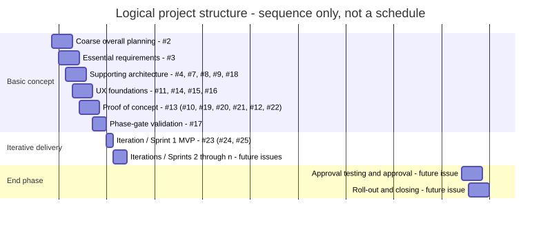

# Project Management

- Status: draft
- Owner: Management
- Last reviewed: 2026-08-17

This overview communicates the coarse logical structure of the project without calendar dates or delivery forecasts. [GitHub Issues](https://github.com/hochschule-darmstadt/a3se_app/issues) are authoritative for individual tasks, dependencies, scope, and completion evidence; the [GitHub Project board](https://github.com/orgs/hochschule-darmstadt/projects/2/views/2) is authoritative for the workflow states `Open`, `In progress`, and `Done`.

## Logical structure

The Gantt chart expresses logical order and coarse grouping only. Its equal-sized `Step` units are neither calendar dates nor effort estimates. The Basic Concept phase establishes enough lifecycle discipline, requirements, architecture, UX foundations, and technical evidence to support iterative delivery. It closes with the Project Management-led harness validation in #17 after the proof of concept in #13. The first post-Basic-Concept iteration is the MVP tracked by #23; later iterations are intentionally not predicted. The end phase begins only after the required increments and their evidence are complete.

## Coarse tasks and issue mapping

| Phase | Coarse task | Existing GitHub Issues | Purpose |
|---|---|---|---|
| Basic concept | Coarse overall planning | [#2](https://github.com/hochschule-darmstadt/a3se_app/issues/2) | Establish the initial lifecycle harness and overall working structure. |
| Basic concept | Essential requirements | [#3](https://github.com/hochschule-darmstadt/a3se_app/issues/3) | Establish the initial requirements baseline needed for architecture and implementation decisions. |
| Basic concept | Supporting architecture | [#4](https://github.com/hochschule-darmstadt/a3se_app/issues/4), [#7](https://github.com/hochschule-darmstadt/a3se_app/issues/7), [#8](https://github.com/hochschule-darmstadt/a3se_app/issues/8), [#9](https://github.com/hochschule-darmstadt/a3se_app/issues/9), [#18](https://github.com/hochschule-darmstadt/a3se_app/issues/18) | Establish technology, modular software architecture, deployment architecture, the entity model, and authoritative flexible terminology. |
| Basic concept | UX foundations | [#11](https://github.com/hochschule-darmstadt/a3se_app/issues/11), [#14](https://github.com/hochschule-darmstadt/a3se_app/issues/14), [#15](https://github.com/hochschule-darmstadt/a3se_app/issues/15), [#16](https://github.com/hochschule-darmstadt/a3se_app/issues/16) | Establish activity-flow input, wireframes, navigation maps, and the shared Customer/Staff design system. |
| Basic concept | Test-data specification | [#10](https://github.com/hochschule-darmstadt/a3se_app/issues/10) | Specify coherent, reusable, synthetic scenarios and catalogs for implementation and validation. |
| Basic concept | Proof of concept | [#13](https://github.com/hochschule-darmstadt/a3se_app/issues/13), with ordered subissues [#19](https://github.com/hochschule-darmstadt/a3se_app/issues/19), [#20](https://github.com/hochschule-darmstadt/a3se_app/issues/20), [#21](https://github.com/hochschule-darmstadt/a3se_app/issues/21), [#12](https://github.com/hochschule-darmstadt/a3se_app/issues/12), and [#22](https://github.com/hochschule-darmstadt/a3se_app/issues/22) | Scaffold the applications; decide the flexible Python/Neo4j mapping; implement the Resources CRUD API; generate deterministic seeded data; then implement the Customer/Staff frontend thin slice. |
| Basic concept | Phase-gate validation | [#17](https://github.com/hochschule-darmstadt/a3se_app/issues/17) | After #13, independently validate the lifecycle harness and close the Basic Concept phase through stakeholder discussion. |
| Iterative delivery | Iteration / Sprint 1 - MVP | [#23](https://github.com/hochschule-darmstadt/a3se_app/issues/23), with initial subissues [#24](https://github.com/hochschule-darmstadt/a3se_app/issues/24) and [#25](https://github.com/hochschule-darmstadt/a3se_app/issues/25) | Deliver the first accepted product increment. Current scoped work establishes the CCT logo and open-licensed Customer Portal imagery; further MVP details remain to be refined in #23. |
| Iterative delivery | Iteration / Sprint 2 through n | Future delivery issues | Repeat incremental delivery until the intended product scope and quality evidence are complete. |
| End phase | Approval testing and approval | Future issue | Perform independent approval testing, resolve blocking findings, and record formal approval. |
| End phase | Roll-out and closing | Future issue | Roll out the approved system, hand over operational responsibility, close residual work explicitly, and conclude the project. |

Issue numbers identify current coarse-grained work; they do not duplicate issue content or imply that an issue's workflow state equals specification acceptance. Subissue order communicates intended sequence, while formal GitHub dependencies remain authoritative for blocking. Create later iteration and end-phase issues only when their scope and entry conditions are known.
