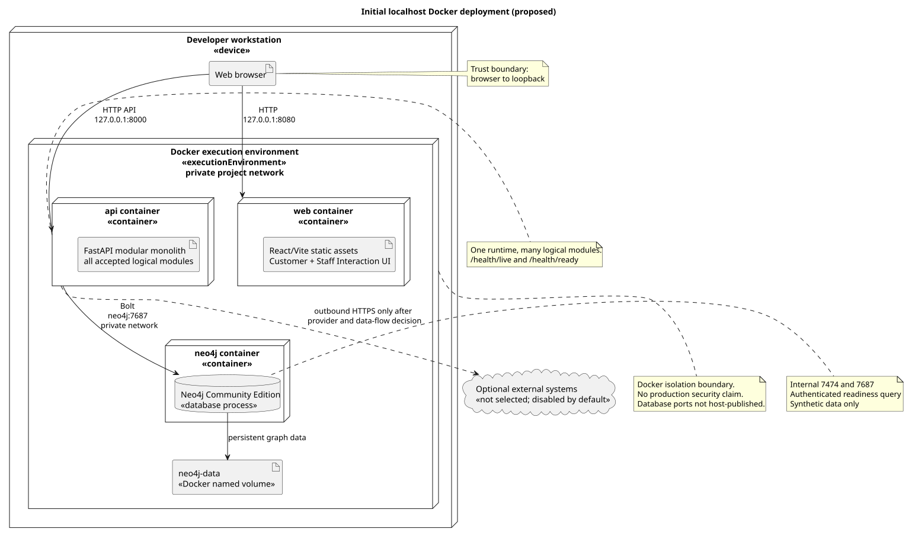

# Localhost Deployment Architecture

- Status: proposed
- Owner: Operations/Architecture
- Last reviewed: 2026-08-18

## Scope and authority

[DR-0011](../../governance/decisions/0011-use-docker-for-localhost-deployment.md) selects Docker on one developer workstation as the initial development and proof-of-concept boundary. This specification maps the accepted [modular software architecture](../../architecture/software-architecture/software-architecture.md) and [technology profile](../../architecture/technology.md) to that boundary. It does not select a server, cloud, hosting provider, remote environment, CI/CD product, or production topology.

Docker, localhost, React/Vite/Mantine, one Python/FastAPI modular monolith, and Neo4j Community Edition are selected facts. Port numbers, volume names, configuration names, and health endpoints below are proposals for implementation. Production capacity, availability, backup, recovery, observability, network security, and operational access are deferred.

[PlantUML source](deployment-architecture.puml)

## DEP-001 Runtime topology

One workstation contains the browser and Docker execution environment. Docker contains the minimum three runtime units:

| Runtime | Artifact and logical mapping | Interfaces | Persistence |
|---|---|---|---|
| web | immutable static assets built from the shared React client platform; Customer and Staff Interaction presentation code | loopback 127.0.0.1:8080 to container HTTP 8080; browser calls the API | none |
| api | one Python/FastAPI process containing every accepted logical module as a modular monolith | loopback 127.0.0.1:8000 to HTTP 8000; internal Bolt to neo4j:7687 | no host filesystem writes; document storage remains undecided |
| neo4j | Neo4j Community Edition database; physical consolidation does not change module-owned writes | internal Docker network only at 7687 and 7474; no host publication by default | named volume neo4j-data |
| seed (issue #12) | one-shot batch job running the same `api` image with `python scripts/seed_data.py` as its command instead of `serve.py`; loads/reloads the deterministic seed data through `api`'s own module services | internal Bolt to neo4j:7687 only; no published port | none of its own; writes into the neo4j volume above |

Logical modules remain packages and in-process dependencies inside api; they are not containers. One private project network connects the units. Only web and api publish loopback-bound ports. Docker service names are internal discovery names. `seed` is not a fourth long-running runtime unit -- it is `api`'s own image, run to completion once per invocation, under Compose's `seed` profile (excluded from the default `docker compose up`) so ordinary startup never mutates or duplicates retained data; an operator opts in explicitly (`docker compose --profile seed run seed`, or `...run seed-reset` to delete and reload). `web` is not yet built -- issue #12 added `backend/Dockerfile` and the root `docker-compose.yml` for `neo4j`/`api`/`seed`/`seed-reset` only, leaving `web`'s containerization to a later frontend issue.

## DEP-002 Images and builds

- Application images use pinned, NFR-003-reviewed base versions and non-root runtime users. Floating latest tags are prohibited.
- Web uses a multi-stage build: the selected Node version produces Vite assets and a small static runtime serves only the output.
- Api installs locked Python dependencies and starts one FastAPI process without development auto-reload.
- Neo4j uses a pinned Community Edition image consistent with DR-0010.
- Build contexts exclude VCS data, environments, caches, reports, secrets, and personal data.
- Digests, SBOMs, vulnerability policy, and provenance remain implementation/security work.

Issue #12 added `backend/Dockerfile` (single-stage: pinned `python:3.13-slim`, `pip install -e .` against the pinned `pyproject.toml` dependencies, DR-0010) and the root `docker-compose.yml`, resolving DEP-Q-001 for the backend/database scope: `api`, `neo4j`, `seed`, and `seed-reset` now build and start. `web`'s Vite multi-stage build remains undone -- no frontend Dockerfile exists yet -- so DEP-Q-001 stays open for that unit.

## DEP-003 Configuration and secrets

Configuration enters through explicitly named environment variables or mounted local files excluded from version control. A committed example may contain names and safe synthetic defaults, never credentials.

| Name | Consumer | Proposed purpose |
|---|---|---|
| APP_API_BASE_URL | web build | browser API origin; default http://127.0.0.1:8000 |
| APP_ENV / APP_LOG_LEVEL | api | local / INFO; sensitive payload logging remains prohibited |
| CCT_NEO4J_URI | api, seed | bolt://neo4j:7687 |
| CCT_NEO4J_USER | api, seed | local non-secret account name |
| CCT_NEO4J_PASSWORD | api, seed, and neo4j | required local secret supplied outside Git |
| CCT_API_HOST | api | `0.0.0.0` inside the container so the process is reachable across the Compose network; the host-side exposure stays loopback-only via the port mapping below, not this bind address |

This table's env var names were originally proposed as `NEO4J_URI`/`NEO4J_USERNAME`/`NEO4J_PASSWORD` before any backend code existed; issue #12 corrected them to the `CCT_NEO4J_*` names `backend/scripts/serve.py` and every Neo4j-backed test already use (DR-0012/DR-0013), rather than renaming working code to match a doc that predated it.

The browser never receives database credentials. Product agents receive controlled application tools, not database configuration. External AI or supplier connectivity requires a selected provider, data-flow/privacy review, allow-list, timeout, and failure policy before outbound access is enabled.

## DEP-004 Startup, health, and readiness

Compose shall create the network and volume, start Neo4j, wait for authenticated readiness, start api, then make web available. Ordering alone is insufficient; dependants use health conditions and bounded retry.

| Probe | Success means | Does not mean |
|---|---|---|
| Neo4j health | Bolt accepts an authenticated trivial query | schema or business data are ready |
| GET /health/live | API event loop responds | dependencies are usable |
| GET /health/ready | configuration and initialization are valid and Neo4j answers a bounded query | optional integrations are healthy |
| web GET /health | static server responds | API or journeys are ready |

Readiness exposes stable dependency codes without credentials, connection strings, stack traces, or customer data. Probes have short timeouts and never mutate business state.

**Limitation (issue #12):** `GET /health/live`/`GET /health/ready` remain proposed only -- `cct.api` implements no health route yet. `docker-compose.yml` therefore health-checks `neo4j` directly (an HTTP probe against its own `:7474`) and gates `api`/`seed`/`seed-reset` startup on that, not on a real API-readiness probe. Adding the health endpoints is implementation work for a future issue, not introduced here.

## DEP-005 Persistence, reset, and recovery

The neo4j-data volume survives container recreation and normal shutdown. A destructive reset removes only the resolved project volume after operator confirmation; it never targets an unresolved variable, broad host path, or unrelated volume.

Local recovery evidence shall create synthetic data through an owned operation, recreate containers, verify persistence, create a version-supported dump while stopped if required, reset, restore, and re-verify. Exact commands await the pinned image. This proves local mechanics only, not production recovery objectives. Generated documents remain excluded until the storage-port decision.

## DEP-006 Operations and failures

The later runbook shall validate configuration and occupied ports; build; start and wait for health; inspect bounded logs; exercise readiness; stop without deleting data; restart and verify persistence; and perform an explicit scoped reset/recovery.

| Failure | Required observation and recovery |
|---|---|
| missing configuration | fail before traffic; name the setting, not its value |
| port conflict | identify the occupied loopback port; use an approved override or stop the conflict |
| Neo4j unavailable | API liveness remains, readiness fails, affected operations report recoverable unavailability |
| API unavailable | client shows recoverable unavailability; no pending action appears completed |
| restart loop | bounded on-failure retry; repeated failure remains visible |
| corrupt/incompatible volume | readiness fails; no automatic reset; operator follows version-specific recovery |
| external dependency failure | only affected capability degrades; timeout and uncertainty remain explicit |

An on-failure policy with bounded retries is proposed. Automatic migration, rollback, and volume deletion are prohibited until specified.

## DEP-007 Trust boundaries and limitations

The diagram identifies browser-to-loopback, Docker network, FastAPI application, and persistence boundaries. Loopback reduces accidental LAN exposure but is not authentication, encryption, firewalling, or hostile-host isolation. A developer with host or Docker-daemon access can inspect containers, environment, traffic, and volumes.

Production customer data, credentials, and backups are prohibited. Synthetic examples are required. Containers do not replace module authorization, controlled agent tools, database least privilege, input validation, audit, or dependency maintenance.

Localhost cannot prove remote TLS, segmentation, secret distribution, multi-user access, production monitoring, capacity, availability, online backup, recovery objectives, upgrades, scaling, or disaster recovery.

## Acceptance evidence

| Evidence | Result on 2026-08-17 |
|---|---|
| DR-0010/0011 and module mapping reviewed | pass |
| PlantUML syntax and SVG render | pass |
| Visual SVG review | pass: nodes, paths, ports, volume, and boundary notes are legible |
| harness, links, and architecture checks | pass |
| Docker build and Compose configuration | pass for `neo4j`/`api`/`seed`/`seed-reset` (issue #12); blocked for `web` (no frontend Dockerfile yet) |
| startup, health, persistence, restart, reset, and recovery | manually smoke-tested for `neo4j`/`api`/`seed` (issue #12): `docker compose up` reaches healthy `neo4j` then `api`; `docker compose --profile seed run seed` loads the full seed dataset idempotently; `--profile seed run seed-reset` deletes and reloads it. Restart/recovery drills beyond that (DEP-005/DEP-006's fuller runbook) remain open |
| Security/Privacy analysis | proposed above; independent review pending |

AI drafted the mapping. Critical review rejected one-container-per-module, public database ports, invented production hosts, bind-mounted source as the reproducible topology, embedded secrets, fake application containers, and production-readiness claims.

Issue #12 (2026-08-18): AI added `backend/Dockerfile` and `docker-compose.yml` against this already-accepted topology, corrected the `NEO4J_*` env var names to match the `CCT_NEO4J_*` names the actual code already used, and used Compose profiles (not a documented-but-unenforced convention) so the seed one-shot job cannot run as part of ordinary startup. Critical review confirmed the `api` container needed a configurable bind host (`CCT_API_HOST`) since `serve.py`'s hardcoded loopback bind is correct for local dev but unreachable from other containers on the Compose network -- `serve.py` was changed to read it, defaulting to the original `127.0.0.1` so non-Compose local usage is unaffected.

## Open questions

| ID | Question | Owner and resolution |
|---|---|---|
| DEP-Q-001 | When do React/FastAPI source and packaging authorize Dockerfiles and Compose? | Implementation/Architecture; resolved for `api`/`neo4j`/`seed` by issue #12 (`backend/Dockerfile`, `docker-compose.yml`); still open for `web`, pending a frontend build/packaging issue |
| DEP-Q-002 | Which pinned images satisfy NFR-003 and supply-chain policy? | Implementation/Security; licence and image review |
| DEP-Q-003 | What production capacity, availability, recovery, observability, network, and access objectives apply? | Requirements/Operations/Security |
| DEP-Q-004 | Which server or hosting platform, if any, follows localhost validation? | Architecture/Operations/Management; later decision |
| DEP-Q-005 | What generated-document storage and local persistence policy apply? | Requirements/Architecture; storage decision |
