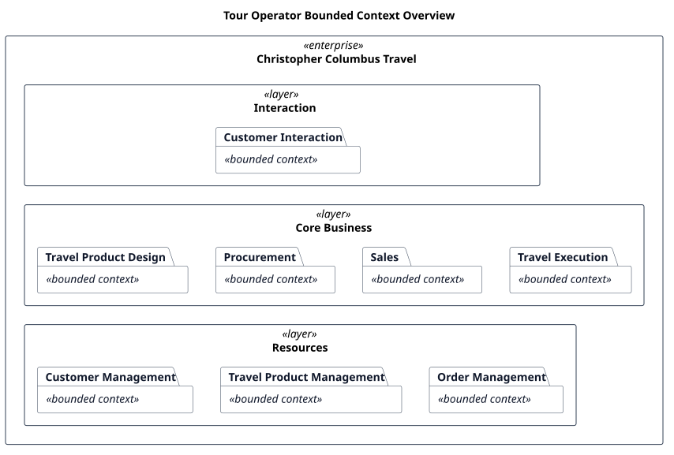

# Bounded Contexts

- Status: accepted
- Owner: Requirements
- Last reviewed: 2026-08-01

Bounded contexts divide the tour operator enterprise into explicit business boundaries with distinct responsibilities, language, and owned information.

## Overview

The diagram uses nested UML packages for the enterprise, layers, and bounded contexts.

The diagram shows business boundaries, not implementation scope. Under [SE-001](../scope-exclusions.md), the project covers only interfaces to Accounting, Reporting, and Human Resources; implementing those three bounded contexts is excluded.

## Bounded contexts

| Context | Purpose | Layer | Owned information |
|---|---|---|---|
| Customer Interaction | Provide customers with seamless interaction with the tour operator and its travel advisor across supported channels and devices | Interaction | Customer-facing interaction |
| Staff Interaction | Provide staff with role-appropriate interaction across the tour operator's business processes | Interaction | Staff-facing interaction |
| Supplier Interaction | Provide suppliers and intermediaries with coordinated interaction across supported business processes | Interaction | Supplier- and intermediary-facing interaction |
| Travel Product Design | Design package travel and compose individual travel from travel services | Core Business | Travel compositions and itineraries |
| Procurement | Obtain stock services and establish access to on-demand sourced services | Core Business | Procurement terms and purchased capacity |
| Sales | Guide customers toward an orderable composition and sale price | Core Business | Sales interaction and commercial offer |
| Travel Execution | Coordinate the activities needed to carry out ordered travel | Core Business | Execution state and coordination |
| Customer Management | Maintain customer information needed across the tour operator cycle | Resources | Customer records |
| Travel Product Management | Maintain travel products and travel services independently of their use in specific travel | Resources | Travel products, travel services, and availability inputs |
| Order Management | Maintain the central record for ordered travel | Resources | Travel orders and their lifecycle |
| Accounting | Record and reconcile the tour operator's financial transactions and obligations | Supporting Processes | Accounting records and reconciliation state |
| Reporting | Define and produce business reports for oversight, analysis, and decision support | Supporting Processes | Report definitions and generated reports |
| Human Resources | Maintain workforce information needed to support employment and organizational responsibilities | Supporting Processes | Workforce and employment records |
