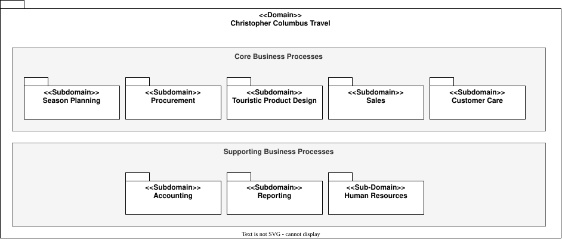

# Business Domains and Subdomains

- Status: accepted
- Owner: Requirements
- Last reviewed: 2026-08-03

This model divides the Christopher Columbus Travel enterprise into business domains and subdomains. A subdomain is a problem-space boundary with a coherent business purpose and language. Subdomains are initial candidates for software modules, not predetermined implementation boundaries; architecture refinement may split a subdomain across several modules or extract reusable resource modules.

## Overview

The diagram uses nested UML packages for the enterprise, domains, and subdomains. It describes the business problem space, not software layers, deployment units, or persistence ownership.

## Domains and subdomains

| Domain | Subdomain | Purpose |
|---|---|---|
| Interaction | Customer Interaction | Provide customers and travelers with consistent access to advice, composition, sales, ordering, payment, and care capabilities. |
| Interaction | Staff Interaction | Provide staff with role-appropriate access to planning, procurement, product design, product maintenance, and customer-care work. |
| Core Business Processes | Season Planning | Plan seasonal offerings and the capacity required to support them. |
| Core Business Processes | Procurement | Procure travel-service capacity in advance under agreed commercial terms. |
| Core Business Processes | Touristic Product Design | Design reusable package travel and compose customer-specific travel from touristic products. |
| Core Business Processes | Sales | Create, validate, offer, and accept commercial travel proposals and initiate orders. |
| Core Business Processes | Customer Care | Prepare ordered travel, deliver travel information and documents, and coordinate assistance during and after travel. |
| Supporting Business Processes | Accounting | Record and reconcile financial transactions and obligations through an external contract. |
| Supporting Business Processes | Reporting | Produce business information for oversight and decision support through an external contract. |
| Supporting Business Processes | Human Resources | Support workforce and organizational responsibilities through an external contract. |

Under [SE-001](../scope-exclusions.md), only the interfaces to Accounting, Reporting, and Human Resources are in implementation scope. Under [SE-002](../scope-exclusions.md), customer-time on-demand acquisition is excluded; Procurement covers capacity obtained before sale.

## From subdomains to modules

The accepted [modular software architecture](../../architecture/software-architecture/software-architecture.md) begins with these subdomains and then refines them. Customer Interaction, Staff Interaction, Strategic Planning, Procurement, Touristic Product Design, Sales, and Customer Care remain recognisable module candidates. Customer Management, Supplier Management, Touristic Product Management, Inventory, and Order Management are extracted as reusable Resources modules because several core processes need their information and lifecycle responsibilities.

This refinement is intentional: the domain diagram remains authoritative for problem-space decomposition, while the software architecture is authoritative for solution-space module boundaries.
