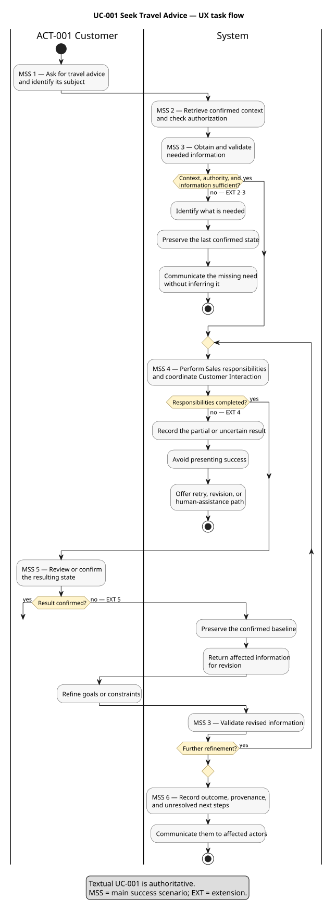

# Seek Travel Advice

- Status: proposed
- Owner: Requirements
- Catalog ID: [UC-001](use-cases.md)
- Owning domain: Sales
- Primary actor: [Customer](../actors.md)
- Supporting actors: [Traveler](../actors.md); [Travel Advisor](../actors.md)
- Source/evidence: [accepted use-case catalog](use-cases.md), [product vision](../vision.md), and [glossary](../glossary.md)
- Last reviewed: 2026-08-14

## Goal and scope

Enable the Customer to express and iteratively refine travel goals through structured search or conversation while preserving confirmed context.

## UX task-flow view



This proposed synchronized view follows the [activity-diagram standard](../../governance/standards/use-case-activity-diagrams.md) and belongs to the documented [pilot](activity-diagram-pilot.md). The textual scenario below remains authoritative.

## Preconditions

access to an interaction channel.

## Trigger

The Customer enters travel criteria or asks for travel advice.

## Main success scenario

1. The Customer initiates the use case through structured search or conversation and identifies its subject.
2. The system retrieves the relevant confirmed context and checks authorization.
3. The system obtains and validates the information needed for the requested outcome.
4. The system performs the responsibilities owned by Sales and coordinates required modules, including Customer Interaction.
5. The Customer reviews or confirms the resulting state.
6. The system records the outcome, provenance, and unresolved next steps and communicates them to affected actors.

## Extensions

| Step/condition | Alternative or failure handling |
|---|---|
| 2-3. Required context, authority, or information is missing | Do not infer it; identify what is needed and preserve the last confirmed state. |
| 4. A participating context or external party cannot complete its responsibility | Record the partial or uncertain result, avoid presenting success, and provide a retry, revision, or human-assistance path. |
| 5. The primary actor rejects or changes the result | Preserve the confirmed baseline and return the affected information for revision. |

## Success guarantee

relevant advice and a resumable confirmed context.

## Minimal guarantee

unconfirmed preferences are not treated as agreed.

## Policies and information

travel search criteria, matching Travel Products, travel goals, constraints, preferences, open questions, handover state.

Detailed policies and stated gaps require stakeholder confirmation.

## Applicable cross-cutting requirements

- [FR-001 through FR-004](../functional-requirements.md): interaction language, language extensibility, web delivery, and responsive customer interaction
- [NFR-002](../non-functional-requirements.md): conversational response time

## Use-case-specific quality and compliance considerations

distinguish advice from a committed Sales Offer; provide human handover.

## Acceptance example

```gherkin
Scenario: Seek Travel Advice
  Given the Customer stated an initial travel idea
  When the Customer refines goals and constraints
  Then the Customer receives relevant options or an explanation that none fit

Scenario: Refine structured travel search
  Given the anonymous Customer has entered destination, dates, and traveler criteria
  When matching travel products are shown and the Customer refines one criterion
  Then the results reflect the revised criteria without requiring registration or sign-in
```
