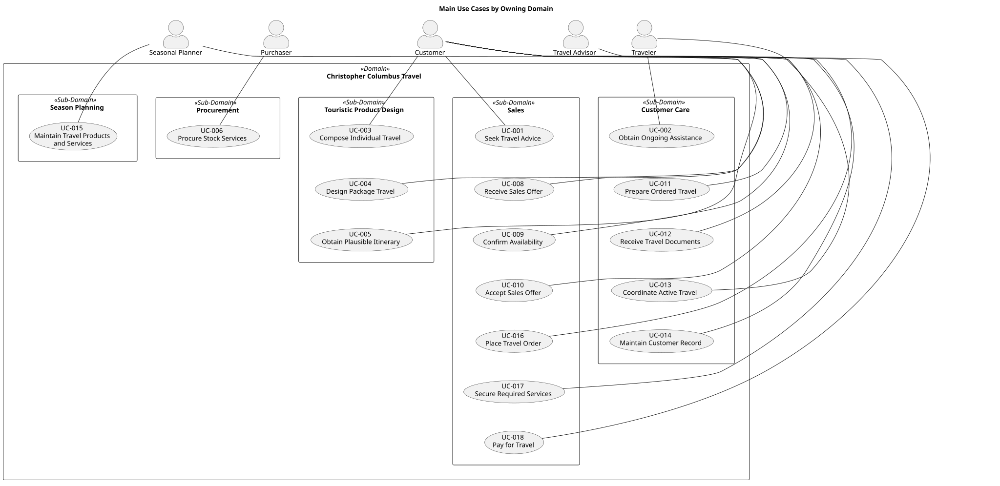

# Use Cases

- Status: accepted
- Owner: Requirements
- Last reviewed: 2026-08-05

## Overview

The diagram groups the main actor goals by their owning domain and shows each use case's primary actor. The catalog below is authoritative and additionally identifies supporting actors.

Use cases describe actor goals and observable system responsibilities. The primary actor is the external role whose goal initiates the use case or receives its result; the primary actor does not necessarily perform the system's internal work. An automated travel advisor operating inside the system boundary is system behavior, while a human Travel Advisor is an actor. Each active use case is assigned to the domain that owns its business outcome. The software modules participating in that behaviour are separately derived in the architecture sequence diagrams.

| ID | Use case and outcome | Primary actor | Supporting actors | Owning domain |
|---|---|---|---|---|
| UC-001 | **Seek travel advice:** express travel goals and iteratively refine needs through seamless interaction | [ACT-001 Customer](../actors.md) | [ACT-002 Traveler](../actors.md); [ACT-003 Travel Advisor](../actors.md) | Sales |
| UC-002 | **Obtain ongoing travel assistance:** continue an existing interaction during travel or after travel without restarting the relationship | [ACT-002 Traveler](../actors.md) | [ACT-001 Customer](../actors.md); [ACT-003 Travel Advisor](../actors.md) | Customer Care |
| UC-003 | **Compose individual travel:** assemble a coherent itinerary from selected travel services around individual needs | [ACT-001 Customer](../actors.md) | [ACT-002 Traveler](../actors.md); [ACT-003 Travel Advisor](../actors.md) | Touristic Product Design |
| UC-004 | **Design package travel:** define a reusable package-travel composition for a seasonal offering | [ACT-004 Seasonal Planner](../actors.md) | [ACT-005 Purchaser](../actors.md) | Touristic Product Design |
| UC-005 | **Obtain a plausible itinerary:** receive confirmation that a proposed composition is operationally coherent and allowed | [ACT-001 Customer](../actors.md) | [ACT-003 Travel Advisor](../actors.md) | Touristic Product Design |
| UC-006 | **Procure stock services:** secure travel-service capacity in advance under agreed commercial terms | [ACT-005 Purchaser](../actors.md) | [ACT-006 Supplier](../actors.md) | Procurement |
| UC-008 | **Receive a sales offer:** obtain an orderable travel composition with its sale price, validity, and commercial conditions | [ACT-001 Customer](../actors.md) | [ACT-003 Travel Advisor](../actors.md) | Sales |
| UC-009 | **Obtain availability confirmation:** learn whether sufficient pre-procured capacity remains available for every required travel service before ordering | [ACT-001 Customer](../actors.md) | [ACT-003 Travel Advisor](../actors.md) | Sales |
| UC-010 | **Accept a sales offer:** explicitly confirm the offered composition, price, and conditions as the basis for an order | [ACT-001 Customer](../actors.md) | [ACT-003 Travel Advisor](../actors.md) | Sales |
| UC-011 | **Prepare ordered travel:** coordinate the confirmed services and information needed for travel to proceed | [ACT-003 Travel Advisor](../actors.md) | [ACT-002 Traveler](../actors.md); [ACT-006 Supplier](../actors.md) | Customer Care |
| UC-012 | **Receive travel documents:** obtain the documents required to undertake or evidence ordered travel when their release conditions are satisfied | [ACT-001 Customer](../actors.md) | [ACT-002 Traveler](../actors.md); [ACT-003 Travel Advisor](../actors.md) | Customer Care |
| UC-013 | **Coordinate active travel:** respond to execution events and coordinate relevant parties while travel is underway | [ACT-002 Traveler](../actors.md) | [ACT-001 Customer](../actors.md); [ACT-003 Travel Advisor](../actors.md); [ACT-006 Supplier](../actors.md) | Customer Care |
| UC-014 | **Maintain a customer record:** establish and update the authoritative customer information needed across the tour operator cycle | [ACT-001 Customer](../actors.md) | [ACT-003 Travel Advisor](../actors.md) | Customer Care |
| UC-015 | **Maintain travel products and services:** maintain reusable travel products, travel-service definitions, validity, and availability inputs | [ACT-004 Seasonal Planner](../actors.md) | [ACT-005 Purchaser](../actors.md); [ACT-006 Supplier](../actors.md) | Season Planning |
| UC-016 | **Place a travel order:** create the central record for travel after a customer accepts a sales offer | [ACT-001 Customer](../actors.md) | [ACT-002 Traveler](../actors.md); [ACT-003 Travel Advisor](../actors.md) | Sales |
| UC-017 | **Secure required travel services:** allocate pre-procured capacity to every travel service required by a travel order with coherent outcomes | [ACT-001 Customer](../actors.md) | [ACT-003 Travel Advisor](../actors.md) | Sales |
| UC-018 | **Pay for travel:** make a payment or deposit against the travel order and learn whether payment-dependent activities may proceed | [ACT-001 Customer](../actors.md) | [ACT-003 Travel Advisor](../actors.md) | Sales |

## Detailed specifications

- [UC-001: Seek Travel Advice](uc-001-seek-travel-advice.md)
- [UC-002: Obtain Ongoing Travel Assistance](uc-002-obtain-ongoing-travel-assistance.md)
- [UC-003: Compose Individual Travel](uc-003-compose-individual-travel.md)
- [UC-004: Design Package Travel](uc-004-design-package-travel.md)
- [UC-005: Obtain a Plausible Itinerary](uc-005-obtain-plausible-itinerary.md)
- [UC-006: Procure Stock Services](uc-006-procure-stock-services.md)
- [UC-008: Receive a Sales Offer](uc-008-receive-sales-offer.md)
- [UC-009: Obtain Availability Confirmation](uc-009-obtain-availability-confirmation.md)
- [UC-010: Accept a Sales Offer](uc-010-accept-sales-offer.md)
- [UC-011: Prepare Ordered Travel](uc-011-prepare-ordered-travel.md)
- [UC-012: Receive Travel Documents](uc-012-receive-travel-documents.md)
- [UC-013: Coordinate Active Travel](uc-013-coordinate-active-travel.md)
- [UC-014: Maintain a Customer Record](uc-014-maintain-customer-record.md)
- [UC-015: Maintain Travel Products and Services](uc-015-maintain-travel-products-and-services.md)
- [UC-016: Place a Travel Order](uc-016-place-travel-order.md)
- [UC-017: Secure Required Travel Services](uc-017-secure-required-travel-services.md)
- [UC-018: Pay for Travel](uc-018-pay-for-travel.md)

Each proposed detail defines a main success scenario, extensions, guarantees, policies and information needs, applicable cross-cutting requirement identifiers, and an initial acceptance example. Use cases remain authoritative for actor-goal behavior. Cross-cutting statements belong in the [functional](../functional-requirements.md) or [non-functional](../non-functional-requirements.md) requirement catalog and are referenced rather than repeated. Policy gaps remain explicit until supported by stakeholder evidence.

## Retired use cases

| ID | Use case | Retirement reason | Status |
|---|---|---|---|
| UC-007 | [Arrange On-demand Sourcing](uc-007-arrange-on-demand-sourcing.md) | Customer-time acquisition is excluded by [SE-002](../scope-exclusions.md). The identifier is retained and shall not be reused. | deprecated |
