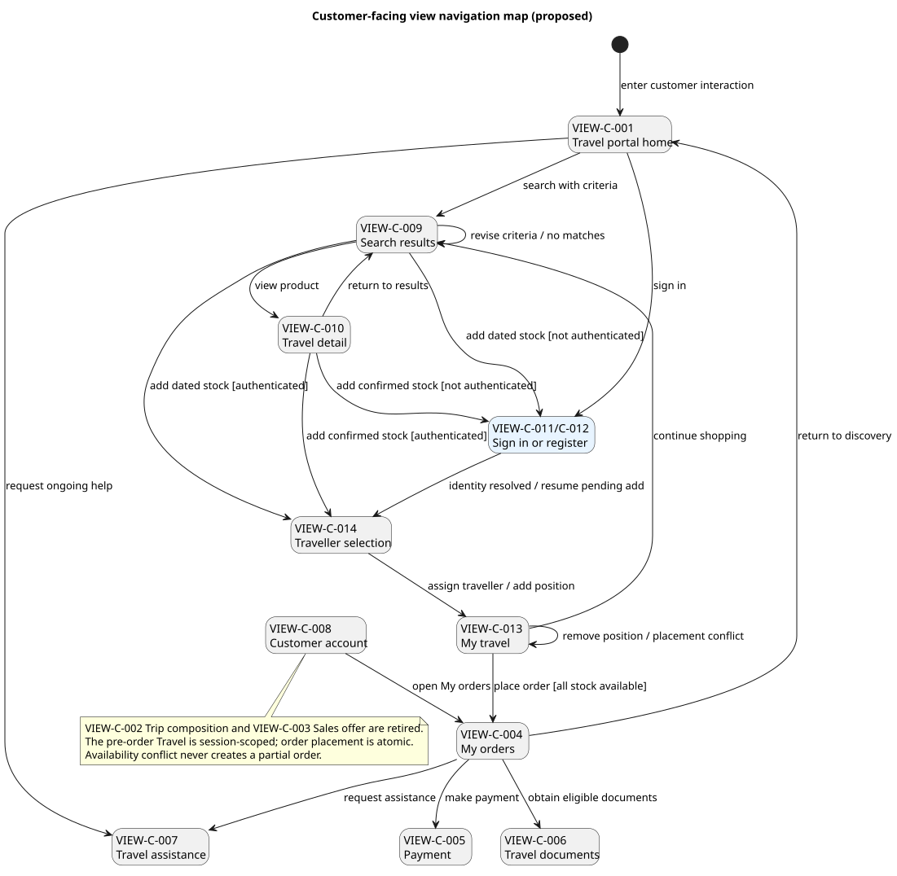
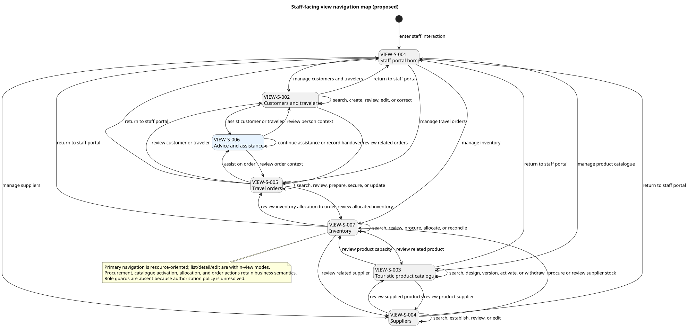

# View Navigation Maps

- Status: proposed
- Owner: Requirements
- Last reviewed: 2026-08-14

## Scope and authority

These maps are UX design inputs derived from the accepted [actors](../../actors.md), [use-case catalog](../../use-cases/use-cases.md), cross-cutting [functional](../../functional-requirements.md) and [non-functional requirements](../../non-functional-requirements.md), and the bounded [comparative UX review](../../sources/ab-in-den-urlaub-ux-review.md). They follow the proposed [view-navigation-map standard](../../../governance/standards/view-navigation-maps.md).

The maps propose page/view boundaries; the use cases remain authoritative for behaviour. A transition means that the named event may navigate between views, not that the system has completed the associated use case. No view or transition is derived from a software module.

## Customer-facing map

[PlantUML source](customer-navigation.puml)

| View ID | Proposed view and purpose | Audience | Requirements evidence | Classification |
|---|---|---|---|---|
| VIEW-C-001 | Travel portal home: begin structured search or express and refine travel goals through advice | Customer | ACT-001; UC-001; FR-005; NFR-002 | Revised proposed boundary; evidenced outcome |
| VIEW-C-002 | Travel composition: review and revise an individual itinerary | Customer | ACT-001; UC-003, UC-005 | Proposed view boundary; evidenced outcome |
| VIEW-C-003 | Sales offer: review composition, price, validity, conditions, availability, and acceptance after authentication | Customer | ACT-001; UC-008, UC-009, UC-010; FR-006 | Proposed consolidation; evidenced information, actions, and guard |
| VIEW-C-004 | Order: review the created Travel Order and required service outcome | Customer | ACT-001; UC-016, UC-017 | Proposed view boundary; evidenced outcome |
| VIEW-C-005 | Payment: submit a payment or Deposit and see its confirmed, pending, or failed outcome | Customer | ACT-001; UC-018 | Proposed view boundary; evidenced outcome |
| VIEW-C-006 | Travel documents: obtain authorized current documents | Customer; Traveler | ACT-001, ACT-002; UC-012 | Proposed view boundary; evidenced outcome |
| VIEW-C-007 | Travel assistance: request and continue contextual support during or after travel | Customer; Traveler | ACT-001, ACT-002; UC-002, UC-013 | Proposed view boundary; evidenced outcome |
| VIEW-C-008 | Customer account: review or correct customer information and access protected journeys | Customer | ACT-001; UC-014; FR-006 | Revised proposed boundary; evidenced outcome |
| VIEW-C-009 | Search results: compare matching travel products and refine criteria when none fit | Customer | ACT-001; UC-001, UC-009; FR-005 | New proposal inspired by comparative UX evidence |
| VIEW-C-010 | Travel detail: understand services, itinerary, dates, price indication, and availability before composition | Customer | ACT-001; UC-003, UC-005, UC-009; FR-005 | New proposal inspired by comparative UX evidence |
| VIEW-C-011 | Sign in: authenticate an existing Customer account and resume the intended journey | Customer | ACT-001; UC-008; FR-006, FR-007 | New evidenced access view; mechanism unresolved |
| VIEW-C-012 | Registration: establish a Customer account and resume the intended journey | Customer | ACT-001; UC-014; FR-006, FR-007 | New evidenced access view; required information unresolved |

The primary path is now a recognisable funnel: discovery/advice → results → travel detail → composition → authenticated Sales Offer → Travel Order. Registration and sign-in are deferred until the Customer requests a Sales Offer, although the account remains directly reachable. Validation, empty results, unavailable inventory, pending payment, and authentication failure remain states of their originating views rather than separate pages; this removes the first map's speculative shared recovery destinations. Favourites, ratings, promotions, checkout add-ons, and content-heavy destination hierarchies observed on the comparison site were not added because project evidence does not require them.

## Staff-facing map

[PlantUML source](staff-navigation.puml)

| View ID | Proposed view and purpose | Audience | Requirements evidence | Classification |
|---|---|---|---|---|
| VIEW-S-001 | Staff portal home: enter and return to the principal managed-data areas | Travel Advisor; Seasonal Planner; Purchaser | ACT-003, ACT-004, ACT-005 | Revised proposal; no accepted dashboard content |
| VIEW-S-002 | Customers and travelers: find, review, create, and correct authorized person records and roles | Travel Advisor | ACT-003; UC-001, UC-002, UC-014 | Revised resource-oriented boundary; evidenced responsibilities |
| VIEW-S-003 | Touristic product catalogue: find, review, design, version, activate, or withdraw Travel Products and Travel Services offered for booking | Seasonal Planner; Purchaser | ACT-004, ACT-005; UC-004, UC-015 | Revised resource-oriented boundary; evidenced outcomes |
| VIEW-S-004 | Suppliers: find, review, establish, and maintain supplier information used by products and procurement | Purchaser | ACT-005, ACT-006; UC-006, UC-015 | Revised resource-oriented boundary; supplier-record maintenance remains partly proposed |
| VIEW-S-005 | Travel orders: find, review, and update orders and initiate preparation, service securing, payment assistance, documents, or active-travel coordination | Travel Advisor | ACT-003; UC-011, UC-012, UC-013, UC-016, UC-017, UC-018 | Revised resource-oriented boundary; evidenced responsibilities |
| VIEW-S-006 | Advice and assistance: contextual workspace opened from a Customer, Traveler, or Travel Order while preserving interaction context | Travel Advisor | ACT-003; UC-001, UC-002, UC-003, UC-005, UC-008, UC-009, UC-010, UC-013 | Retained as a contextual rather than primary managed-data area |
| VIEW-S-007 | Inventory: find and review pre-procured capacity and initiate evidenced procurement or allocation actions | Purchaser; Seasonal Planner; Travel Advisor | ACT-003, ACT-004, ACT-005; UC-006, UC-009, UC-017 | New resource-oriented boundary; direct adjustment rules remain unresolved |

The staff portal is organized around managed business information rather than around architecture modules or a generic CRUD engine. Each primary area is expected to support list, detail, create/edit where the use case permits it, validation, loading, empty, and error states; wireframes own their layout. Business-significant actions retain domain meaning: procurement is initiated in supplier/inventory context, catalogue activation is not a generic update, and order preparation, allocation, payment assistance, documents, and travel coordination remain explicit order actions. Advice and assistance is contextual rather than a sixth global data area.

The map does not assign role guards because authorization policy is unresolved. It does not create a supplier-facing map: ACT-006 participates in UC-006, UC-011, UC-013, and UC-015, but the accepted requirements do not yet define a supplier-primary actor goal or enough view traversal evidence. FR-003 nevertheless requires supplier interactions through a web UI; this is a high-severity requirements gap owned by Requirements and must be resolved before interaction design is accepted.

## Use-case coverage

| Active use cases | Navigation coverage |
|---|---|
| UC-001, UC-002, UC-003, UC-005, UC-008, UC-009, UC-010, UC-012, UC-013, UC-014, UC-016, UC-017, UC-018 | Customer-facing views; registration is covered by UC-014 and authentication is an explicit prerequisite/extension of UC-008; staff support is represented where ACT-003 participates |
| UC-004, UC-006, UC-011, UC-015 | Staff-facing views for their internal primary actors |

The maps intentionally omit UC-007 because it is deprecated under SE-002. They also omit system-internal steps and supplier system-to-system traversal because those are not navigable human views evidenced by the active use cases.

## Cross-cutting navigation expectations

- FR-001 and FR-002 apply to the content of every mapped view.
- FR-003 requires web delivery for all evidenced interactions; the supplier-facing gap above remains unresolved.
- FR-004 requires equivalent customer capabilities at representative PC, tablet, and mobile sizes; responsive presentation must not create device-specific navigation semantics.
- FR-005 permits anonymous discovery through plausibility and availability outcomes.
- FR-006 guards Sales Offer and customer-specific order, payment, and document information behind authenticated customer access.
- FR-007 preserves confirmed journey context across registration or sign-in and returns the Customer to the intended destination.
- NFR-001 applies after navigation-triggering, non-conversational interactions; NFR-002 applies to conversational responses in VIEW-C-001 and VIEW-C-007.
- After traversal, focus placement, page identification, visible current location, keyboard operation, and recovery require stakeholder/accessibility validation. No measurable accessibility requirement has yet been accepted.

## Entry, return, cancellation, recovery, and deep links

- The initial pseudostates identify proposed channel entry destinations, not URLs.
- Named `return`, `revise`, and `cancel` transitions preserve an explicit path back to the prior stable view where evidence supports revision or abandonment.
- Recoverable failures and empty/unavailable outcomes remain within their originating views; they never imply successful completion.
- Direct deep links, browser-history semantics, global navigation availability, session expiry, not-found handling, and the destination after authorization failure are unresolved. They are not shown as accepted transitions.
- A hierarchy-only sitemap is not needed by current evidence. Add one only if information-architecture research produces a question these traversal maps cannot answer.

## Downstream architecture consistency check

Most proposed views can invoke candidate operations already assigned to MOD-CI or MOD-SI, and no map node represents a module. Authentication and Customer-account access are now accepted navigation requirements, but the modular software architecture does not yet allocate responsibility for account credentials, authentication, recovery, or session state; this is an architecture follow-up rather than a reason to weaken the requirements. Supplier-facing web interaction still has no interaction module or navigation evidence. Detailed authorization policy also remains insufficient for staff role guards and protected deep-link behaviour.

## Open questions and ownership

| ID | Question | Owner | Resolution condition |
|---|---|---|---|
| NAV-Q-001 | Who accepts customer-facing and staff-facing navigation? | Requirements/Stakeholder Management | Named accountable stakeholder confirms or rejects the proposed view boundaries and transitions |
| NAV-Q-002 | Which views may be entered by deep link, and what happens when context or authentication is missing? | Requirements/Security | Accepted channel, authentication, and authorization policy |
| NAV-Q-003 | Which destinations are globally available rather than contextual? | Requirements/UX | Stakeholder navigation review |
| NAV-Q-004 | What supplier-facing human navigation is required by FR-003? | Requirements | Supplier actor goals and interaction evidence are accepted or FR-003 applicability is revised |
| NAV-Q-005 | What measurable accessibility outcomes govern navigation? | Requirements/UX/Test | Accessibility requirements and acceptance measures are accepted |
| NAV-Q-006 | Which registration information, authentication factors, account-recovery paths, session rules, and assurance level are required? | Requirements/Security/Privacy | Accepted identity, privacy, and account-recovery policy |

## AI-assisted validation record

AI proposed view groupings and transitions from the active use cases on 2026-08-14 and revised them after stakeholder direction. The customer review rejected copying the comparison site's taxonomy and commercial features, architecture modules as views, a separate sitemap, and separate pages for every failure state. The staff review replaced workflow-first global navigation with resource-oriented Customers and Travelers, Suppliers, Touristic Product Catalogue, Inventory, and Travel Orders while retaining business-significant actions and contextual assistance. The remaining page boundaries are hypotheses pending stakeholder and independent Test/UX/Security review. PlantUML validation and visual inspection demonstrate syntactic and reviewability evidence only, not business acceptance.
